# Auto Populate Opportunity and Contact Info to Quote

## Flow Diagram [(_View History_)](Auto_Populate_Opportunity_and_Contact_Info_to_Quote-history.md)

```mermaid
%% If you read this, your Markdown visualizer does not handle MermaidJS syntax.
%% - If you are in VsCode, install extension `Markdown Preview Mermaid Support` at https://marketplace.visualstudio.com/items?itemName=bierner.markdown-mermaid
%% - If you are using sfdx-hardis, try to define env variable `MERMAID_MODES=cli,docker` ,then run again the command to regenerate markdown with SVG images.
%% - If you are within mkdocs-material, define mermaid plugin in `mkdocs.yml` as described in https://squidfunk.github.io/mkdocs-material/extensions/mermaid/
%% - At last resort, you can copy-paste this MermaidJS code in https://mermaid.live/ to see the Flow Diagram

flowchart TB
START(["START<br/><b>AutoLaunched Flow</b></br>Type: <b> Record After Save</b>"]):::startClass
click START "#general-information" "3351202257"

Contact_Role_of_Opportunity{"🔀 <em></em><br/>Contact Role of Opportunity"}:::decisions
click Contact_Role_of_Opportunity "#contact_role_of_opportunity" "2221579896"

Get_Contact_Record_related_to_Opportunity_Contact_Role[("🔍 <em></em><br/>Get Contact Record related to Opportunity Contact Role")]:::recordLookups
click Get_Contact_Record_related_to_Opportunity_Contact_Role "#get_contact_record_related_to_opportunity_contact_role" "3768477982"

Get_Opportunity_Contact_Role[("🔍 <em></em><br/>Get Opportunity Contact Role")]:::recordLookups
click Get_Opportunity_Contact_Role "#get_opportunity_contact_role" "2187321246"

Update_Quote_which_is_triggering[("🛠️ <em></em><br/>Update Quote which is triggering")]:::recordUpdates
click Update_Quote_which_is_triggering "#update_quote_which_is_triggering" "1919738406"

Update_Type_Sales[("🛠️ <em></em><br/>Update Type = Sales")]:::recordUpdates
click Update_Type_Sales "#update_type_sales" "4112617503"

Contact_Role_of_Opportunity --> |"Contact Role is not Blank"| Update_Quote_which_is_triggering
Contact_Role_of_Opportunity --> |"Default Outcome"| END_Contact_Role_of_Opportunity
Get_Contact_Record_related_to_Opportunity_Contact_Role --> Contact_Role_of_Opportunity
Get_Opportunity_Contact_Role --> Get_Contact_Record_related_to_Opportunity_Contact_Role
Update_Quote_which_is_triggering --> END_Update_Quote_which_is_triggering
Update_Type_Sales --> Get_Opportunity_Contact_Role
START -->  Update_Type_Sales
END_Contact_Role_of_Opportunity(( END )):::endClass
END_Update_Quote_which_is_triggering(( END )):::endClass


classDef actionCalls fill:#D4E4FC,color:black,text-decoration:none,max-height:100px
classDef assignments fill:#FBEED7,color:black,text-decoration:none,max-height:100px
classDef collectionProcessors fill:#F0E3FA,color:black,text-decoration:none,max-height:100px
classDef customErrors fill:#FFE9E9,color:black,text-decoration:none,max-height:100px
classDef decisions fill:#FDEAF6,color:black,text-decoration:none,max-height:100px
classDef loops fill:#FDEAF6,color:black,text-decoration:none,max-height:100px
classDef recordCreates fill:#FFF8C9,color:black,text-decoration:none,max-height:100px
classDef recordDeletes fill:#FFF8C9,color:black,text-decoration:none,max-height:100px
classDef recordLookups fill:#EDEAFF,color:black,text-decoration:none,max-height:100px
classDef recordUpdates fill:#FFF8C9,color:black,text-decoration:none,max-height:100px
classDef screens fill:#DFF6FF,color:black,text-decoration:none,max-height:100px
classDef subflows fill:#D4E4FC,color:black,text-decoration:none,max-height:100px
classDef startClass fill:#D9F2E6,color:black,text-decoration:none,max-height:100px
classDef endClass fill:#F9BABA,color:black,text-decoration:none,max-height:100px


```

<!-- Flow description -->

## General Information

|<!-- -->|<!-- -->|
|:---|:---|
|Object|Quote|
|Process Type| Auto Launched Flow|
|Trigger Type| Record After Save|
|Record Trigger Type| Create And Update|
|Label|Auto Populate Opportunity and Contact Info to Quote|
|Status|Active|
|Description|This flow will fire on Quote Creation and Updation ,It will update Contact on quote from Opportunity Contact Role if Role is Decision Maker and Type = Sales// Added Email ,Bill & ship to Contact,Phone & Fax on 4th April|
|Environments|Default|
|Interview Label|Auto Populate Opportunity and Contact Info to Quote {!$Flow.CurrentDateTime}|
| Builder Type (PM)|LightningFlowBuilder|
| Canvas Mode (PM)|FREE_FORM_CANVAS|
| Origin Builder Type (PM)|LightningFlowBuilder|
|Connector|[Update_Type_Sales](#update_type_sales)|
|Next Node|[Update_Type_Sales](#update_type_sales)|

#### Filters (logic: **and**)

|Filter Id|Field|Operator|Value|
|:-- |:-- |:--:|:--: |
|1|OpportunityId| Is Null|<!-- -->|

## Variables

|Name|Data Type|Is Collection|Is Input|Is Output|Object Type|Description|
|:-- |:--:|:--:|:--:|:--:|:--:|:--  |
|OpportunityIdVar|SObject|⬜|⬜|⬜|Opportunity|<!-- -->|

## Flow Nodes Details

### Contact_Role_of_Opportunity

|<!-- -->|<!-- -->|
|:---|:---|
|Type|Decision|
|Label|Contact Role of Opportunity|
|Default Connector Label|Default Outcome|

#### Rule Contact_Role_is_not_Blank (Contact Role is not Blank)

|<!-- -->|<!-- -->|
|:---|:---|
|Connector|[Update_Quote_which_is_triggering](#update_quote_which_is_triggering)|
|Condition Logic|and|

|Condition Id|Left Value Reference|Operator|Right Value|
|:-- |:-- |:--:|:--: |
|1|Get_Opportunity_Contact_Role.ContactId| Is Null|⬜|
|2|Get_Opportunity_Contact_Role.Role| Equal To|Decision Maker|
|3|$Record.ContactId| Is Null|✅|

### Get_Contact_Record_related_to_Opportunity_Contact_Role

|<!-- -->|<!-- -->|
|:---|:---|
|Type|Record Lookup|
|Object|Contact|
|Label|Get Contact Record related to Opportunity Contact Role|
|Description|This get element is used to fetch contactID|
|Assign Null Values If No Records Found|⬜|
|Get First Record Only|✅|
|Store Output Automatically|✅|
|Connector|[Contact_Role_of_Opportunity](#contact_role_of_opportunity)|

#### Filters (logic: **and**)

|Filter Id|Field|Operator|Value|
|:-- |:-- |:--:|:--: |
|1|Id| Equal To|Get_Opportunity_Contact_Role.ContactId|

### Get_Opportunity_Contact_Role

|<!-- -->|<!-- -->|
|:---|:---|
|Type|Record Lookup|
|Object|OpportunityContactRole|
|Label|Get Opportunity Contact Role|
|Description|This element is used to get opportunity Contact Role|
|Assign Null Values If No Records Found|⬜|
|Get First Record Only|✅|
|Store Output Automatically|✅|
|Connector|[Get_Contact_Record_related_to_Opportunity_Contact_Role](#get_contact_record_related_to_opportunity_contact_role)|

#### Filters (logic: **and**)

|Filter Id|Field|Operator|Value|
|:-- |:-- |:--:|:--: |
|1|OpportunityId| Is Null|<!-- -->|
|2|OpportunityId| Equal To|$Record.Opportunity.Id|
|3|Role| Equal To|Decision Maker|

### Update_Quote_which_is_triggering

|<!-- -->|<!-- -->|
|:---|:---|
|Type|Record Update|
|Label|Update Quote which is triggering|
|Description|This|
|Input Reference|$Record|

#### Input Assignments

|Field|Value|
|:-- |:--: |
|Bill_To_Contact__c|Get_Contact_Record_related_to_Opportunity_Contact_Role.Name|
|ContactId|Get_Opportunity_Contact_Role.ContactId|
|Email|Get_Contact_Record_related_to_Opportunity_Contact_Role.Email|
|Fax|Get_Contact_Record_related_to_Opportunity_Contact_Role.Fax|
|Phone|Get_Contact_Record_related_to_Opportunity_Contact_Role.Phone|
|Ship_To_Contact__c|Get_Contact_Record_related_to_Opportunity_Contact_Role.Name|

### Update_Type_Sales

|<!-- -->|<!-- -->|
|:---|:---|
|Type|Record Update|
|Label|Update Type = Sales|
|Input Reference|$Record|
|Connector|[Get_Opportunity_Contact_Role](#get_opportunity_contact_role)|

#### Filters (logic: **or**)

|Filter Id|Field|Operator|Value|
|:-- |:-- |:--:|:--: |
|1|Type__c| Not Equal To|Sales|
|2|Type__c| Is Null|<!-- -->|

#### Input Assignments

|Field|Value|
|:-- |:--: |
|Type__c|Sales|

___

_Documentation generated from branch main by [sfdx-hardis](https://sfdx-hardis.cloudity.com), featuring [salesforce-flow-visualiser](https://github.com/toddhalfpenny/salesforce-flow-visualiser)_