# Customer Satisfaction Survey Email

## Flow Diagram [(_View History_)](Customer_Survey_Email-history.md)

```mermaid
%% If you read this, your Markdown visualizer does not handle MermaidJS syntax.
%% - If you are in VsCode, install extension `Markdown Preview Mermaid Support` at https://marketplace.visualstudio.com/items?itemName=bierner.markdown-mermaid
%% - If you are using sfdx-hardis, try to define env variable `MERMAID_MODES=cli,docker` ,then run again the command to regenerate markdown with SVG images.
%% - If you are within mkdocs-material, define mermaid plugin in `mkdocs.yml` as described in https://squidfunk.github.io/mkdocs-material/extensions/mermaid/
%% - At last resort, you can copy-paste this MermaidJS code in https://mermaid.live/ to see the Flow Diagram

flowchart TB
START(["START<br/><b>AutoLaunched Flow</b></br>Type: <b> Record After Save</b>"]):::startClass
click START "#general-information" "1780167658"

Customer_Support_Survey("📧 <em></em><br/>Customer Support Survey"):::actionCalls
click Customer_Support_Survey "#customer_support_survey" "1856865195"

Case_Closed_or_Cancelled{"🔀 <em></em><br/>Case Closed or Cancelled"}:::decisions
click Case_Closed_or_Cancelled "#case_closed_or_cancelled" "3605712876"

Customer_Support_Survey --> END_Customer_Support_Survey
Case_Closed_or_Cancelled --> |"Case Closed"| Customer_Support_Survey
Case_Closed_or_Cancelled --> |"Default Outcome"| END_Case_Closed_or_Cancelled
START -->  Case_Closed_or_Cancelled
END_Customer_Support_Survey(( END )):::endClass
END_Case_Closed_or_Cancelled(( END )):::endClass


classDef actionCalls fill:#D4E4FC,color:black,text-decoration:none,max-height:100px
classDef assignments fill:#FBEED7,color:black,text-decoration:none,max-height:100px
classDef collectionProcessors fill:#F0E3FA,color:black,text-decoration:none,max-height:100px
classDef customErrors fill:#FFE9E9,color:black,text-decoration:none,max-height:100px
classDef decisions fill:#FDEAF6,color:black,text-decoration:none,max-height:100px
classDef loops fill:#FDEAF6,color:black,text-decoration:none,max-height:100px
classDef recordCreates fill:#FFF8C9,color:black,text-decoration:none,max-height:100px
classDef recordDeletes fill:#FFF8C9,color:black,text-decoration:none,max-height:100px
classDef recordLookups fill:#EDEAFF,color:black,text-decoration:none,max-height:100px
classDef recordUpdates fill:#FFF8C9,color:black,text-decoration:none,max-height:100px
classDef screens fill:#DFF6FF,color:black,text-decoration:none,max-height:100px
classDef subflows fill:#D4E4FC,color:black,text-decoration:none,max-height:100px
classDef startClass fill:#D9F2E6,color:black,text-decoration:none,max-height:100px
classDef endClass fill:#F9BABA,color:black,text-decoration:none,max-height:100px


```

<!-- Flow description -->

## General Information

|<!-- -->|<!-- -->|
|:---|:---|
|Object|Case|
|Process Type| Auto Launched Flow|
|Trigger Type| Record After Save|
|Record Trigger Type| Update|
|Label|Customer Satisfaction Survey Email|
|Status|Active|
|Interview Label|Customer Survey Email {!$Flow.CurrentDateTime}|
| Builder Type (PM)|LightningFlowBuilder|
| Canvas Mode (PM)|AUTO_LAYOUT_CANVAS|
| Origin Builder Type (PM)|LightningFlowBuilder|
|Connector|[Case_Closed_or_Cancelled](#case_closed_or_cancelled)|
|Next Node|[Case_Closed_or_Cancelled](#case_closed_or_cancelled)|

#### Filters (logic: **and**)

|Filter Id|Field|Operator|Value|
|:-- |:-- |:--:|:--: |
|1|Status| Is Changed|✅|

## Flow Nodes Details

### Customer_Support_Survey

|<!-- -->|<!-- -->|
|:---|:---|
|Type|Action Call|
|Label|Customer Support Survey|
|Action Type|Email Alert|
|Action Name|Case.Customer_Support_Survey_1|
|Flow Transaction Model|CurrentTransaction|
|Name Segment|Case.Customer_Support_Survey_1|
| SObject Row Id (input)|$Record.Id|

### Case_Closed_or_Cancelled

|<!-- -->|<!-- -->|
|:---|:---|
|Type|Decision|
|Label|Case Closed or Cancelled|
|Default Connector Label|Default Outcome|

#### Rule Case_Closed (Case Closed)

|<!-- -->|<!-- -->|
|:---|:---|
|Does Require Record Changed To Meet Criteria|✅|
|Connector|[Customer_Support_Survey](#customer_support_survey)|
|Condition Logic|or|

|Condition Id|Left Value Reference|Operator|Right Value|
|:-- |:-- |:--:|:--: |
|1|$Record.Status| Equal To|Cancelled|
|2|$Record.Status| Equal To|Closed|

___

_Documentation generated from branch main by [sfdx-hardis](https://sfdx-hardis.cloudity.com), featuring [salesforce-flow-visualiser](https://github.com/toddhalfpenny/salesforce-flow-visualiser)_