# Delete Opp Primary Contact

## Flow Diagram [(_View History_)](Delete_Opp_Primary_Contact-history.md)

```mermaid
%% If you read this, your Markdown visualizer does not handle MermaidJS syntax.
%% - If you are in VsCode, install extension `Markdown Preview Mermaid Support` at https://marketplace.visualstudio.com/items?itemName=bierner.markdown-mermaid
%% - If you are using sfdx-hardis, try to define env variable `MERMAID_MODES=cli,docker` ,then run again the command to regenerate markdown with SVG images.
%% - If you are within mkdocs-material, define mermaid plugin in `mkdocs.yml` as described in https://squidfunk.github.io/mkdocs-material/extensions/mermaid/
%% - At last resort, you can copy-paste this MermaidJS code in https://mermaid.live/ to see the Flow Diagram

flowchart TB
START(["START<br/><b>AutoLaunched Flow</b></br>Type: <b> Record Before Delete</b>"]):::startClass
click START "#general-information" "3639279412"

Error_in_Updating_Contact_Role("🚫 <em></em><br/>Error in Updating Contact Role"):::customErrors
click Error_in_Updating_Contact_Role "#error_in_updating_contact_role" "1776879200"

Update_Primary_Contact[("🛠️ <em></em><br/>Update Primary Contact")]:::recordUpdates
click Update_Primary_Contact "#update_primary_contact" "2474105338"

Error_in_Updating_Contact_Role --> END_Error_in_Updating_Contact_Role
Update_Primary_Contact --> END_Update_Primary_Contact
Update_Primary_Contact -. Fault .->Error_in_Updating_Contact_Role
START -->  Update_Primary_Contact
END_Error_in_Updating_Contact_Role(( END )):::endClass
END_Update_Primary_Contact(( END )):::endClass


classDef actionCalls fill:#D4E4FC,color:black,text-decoration:none,max-height:100px
classDef assignments fill:#FBEED7,color:black,text-decoration:none,max-height:100px
classDef collectionProcessors fill:#F0E3FA,color:black,text-decoration:none,max-height:100px
classDef customErrors fill:#FFE9E9,color:black,text-decoration:none,max-height:100px
classDef decisions fill:#FDEAF6,color:black,text-decoration:none,max-height:100px
classDef loops fill:#FDEAF6,color:black,text-decoration:none,max-height:100px
classDef recordCreates fill:#FFF8C9,color:black,text-decoration:none,max-height:100px
classDef recordDeletes fill:#FFF8C9,color:black,text-decoration:none,max-height:100px
classDef recordLookups fill:#EDEAFF,color:black,text-decoration:none,max-height:100px
classDef recordUpdates fill:#FFF8C9,color:black,text-decoration:none,max-height:100px
classDef screens fill:#DFF6FF,color:black,text-decoration:none,max-height:100px
classDef subflows fill:#D4E4FC,color:black,text-decoration:none,max-height:100px
classDef startClass fill:#D9F2E6,color:black,text-decoration:none,max-height:100px
classDef endClass fill:#F9BABA,color:black,text-decoration:none,max-height:100px


```

<!-- Flow description -->

## General Information

|<!-- -->|<!-- -->|
|:---|:---|
|Object|OpportunityContactRole|
|Process Type| Auto Launched Flow|
|Trigger Type| Record Before Delete|
|Record Trigger Type| Delete|
|Label|Delete Opp Primary Contact|
|Status|Active|
|Description|This flow will clear the PrimaryContactName__c & Primary_Contact__c fields when Associated Contact role is deleted|
|Environments|Default|
|Interview Label|Delete Opp Primary Contact {!$Flow.CurrentDateTime}|
| Builder Type (PM)|LightningFlowBuilder|
| Canvas Mode (PM)|AUTO_LAYOUT_CANVAS|
| Origin Builder Type (PM)|LightningFlowBuilder|
|Connector|[Update_Primary_Contact](#update_primary_contact)|
|Next Node|[Update_Primary_Contact](#update_primary_contact)|

#### Filters (logic: **and**)

|Filter Id|Field|Operator|Value|
|:-- |:-- |:--:|:--: |
|1|IsPrimary| Equal To|✅|

## Formulas

|Name|Data Type|Expression|Description|
|:-- |:--:|:-- |:--  |
|ContactName|String|IF(    ISBLANK(TEXT({!$Record.Contact.Salutation})),    {!$Record.Contact.FirstName} & " " & {!$Record.Contact.LastName},    TEXT({!$Record.Contact.Salutation}) & " " & {!$Record.Contact.FirstName} & " " & {!$Record.Contact.LastName} )|This Formula field is used to Add First Name & Last Name|

## Flow Nodes Details

### Error_in_Updating_Contact_Role

|<!-- -->|<!-- -->|
|:---|:---|
|Type|Custom Error|
|Label|Error in Updating Contact Role|
|Custom Error Messages|errorMessage: '{!$Flow.FaultMessage}' isFieldError: false |

### Update_Primary_Contact

|<!-- -->|<!-- -->|
|:---|:---|
|Type|Record Update|
|Object|Opportunity|
|Label|Update Primary Contact|
|Fault Connector|[Error_in_Updating_Contact_Role](#error_in_updating_contact_role)|

#### Filters (logic: **and**)

|Filter Id|Field|Operator|Value|
|:-- |:-- |:--:|:--: |
|1|Id| Equal To|$Record.Opportunity.Id|

#### Input Assignments

|Field|Value|
|:-- |:--: |
|PrimaryContactName__c|stringValue: '' |
|Primary_Contact__c|stringValue: '' |

___

_Documentation generated from branch main by [sfdx-hardis](https://sfdx-hardis.cloudity.com), featuring [salesforce-flow-visualiser](https://github.com/toddhalfpenny/salesforce-flow-visualiser)_