# New Quote

## Flow Diagram [(_View History_)](New_Quote-history.md)

```mermaid
%% If you read this, your Markdown visualizer does not handle MermaidJS syntax.
%% - If you are in VsCode, install extension `Markdown Preview Mermaid Support` at https://marketplace.visualstudio.com/items?itemName=bierner.markdown-mermaid
%% - If you are using sfdx-hardis, try to define env variable `MERMAID_MODES=cli,docker` ,then run again the command to regenerate markdown with SVG images.
%% - If you are within mkdocs-material, define mermaid plugin in `mkdocs.yml` as described in https://squidfunk.github.io/mkdocs-material/extensions/mermaid/
%% - At last resort, you can copy-paste this MermaidJS code in https://mermaid.live/ to see the Flow Diagram

flowchart TB
START(["START<br/><b>Screen Flow</b>"]):::startClass
click START "#general-information" "1788988906"

Redirect_to_New_Quote_Screen("⚡ <em></em><br/>Redirect to New Quote Screen"):::actionCalls
click Redirect_to_New_Quote_Screen "#redirect_to_new_quote_screen" "3969029777"

Set_Account_Exists_To_True[\"🟰 <em></em><br/>Set Account Exists To True"/]:::assignments
click Set_Account_Exists_To_True "#set_account_exists_to_true" "1235909016"

Set_Primary_Contact_Exists_To_True[\"🟰 <em></em><br/>Set Primary Contact Exists To True"/]:::assignments
click Set_Primary_Contact_Exists_To_True "#set_primary_contact_exists_to_true" "4128276208"

Does_Account_Exist{"🔀 <em></em><br/>Does Account Exist?"}:::decisions
click Does_Account_Exist "#does_account_exist" "1044967350"

Does_Primary_Contact_Exist{"🔀 <em></em><br/>Does Primary Contact Exist?"}:::decisions
click Does_Primary_Contact_Exist "#does_primary_contact_exist" "2634455518"

Account[("🔍 <em></em><br/>Account")]:::recordLookups
click Account "#account" "66496250"

Opportunity[("🔍 <em></em><br/>Opportunity")]:::recordLookups
click Opportunity "#opportunity" "1564304077"

Primary_Contact[("🔍 <em></em><br/>Primary Contact")]:::recordLookups
click Primary_Contact "#primary_contact" "3662795384"

Redirect_to_New_Quote_Screen --> END_Redirect_to_New_Quote_Screen
Set_Account_Exists_To_True --> Primary_Contact
Set_Primary_Contact_Exists_To_True --> Redirect_to_New_Quote_Screen
Does_Account_Exist --> |"No"| Primary_Contact
Does_Account_Exist --> |"Yes"| Set_Account_Exists_To_True
Does_Primary_Contact_Exist --> |"Yes"| Set_Primary_Contact_Exists_To_True
Does_Primary_Contact_Exist --> |"No"| Redirect_to_New_Quote_Screen
Account --> Does_Account_Exist
Opportunity --> Account
Primary_Contact --> Does_Primary_Contact_Exist
START -->  Opportunity
END_Redirect_to_New_Quote_Screen(( END )):::endClass


classDef actionCalls fill:#D4E4FC,color:black,text-decoration:none,max-height:100px
classDef assignments fill:#FBEED7,color:black,text-decoration:none,max-height:100px
classDef collectionProcessors fill:#F0E3FA,color:black,text-decoration:none,max-height:100px
classDef customErrors fill:#FFE9E9,color:black,text-decoration:none,max-height:100px
classDef decisions fill:#FDEAF6,color:black,text-decoration:none,max-height:100px
classDef loops fill:#FDEAF6,color:black,text-decoration:none,max-height:100px
classDef recordCreates fill:#FFF8C9,color:black,text-decoration:none,max-height:100px
classDef recordDeletes fill:#FFF8C9,color:black,text-decoration:none,max-height:100px
classDef recordLookups fill:#EDEAFF,color:black,text-decoration:none,max-height:100px
classDef recordUpdates fill:#FFF8C9,color:black,text-decoration:none,max-height:100px
classDef screens fill:#DFF6FF,color:black,text-decoration:none,max-height:100px
classDef subflows fill:#D4E4FC,color:black,text-decoration:none,max-height:100px
classDef startClass fill:#D9F2E6,color:black,text-decoration:none,max-height:100px
classDef endClass fill:#F9BABA,color:black,text-decoration:none,max-height:100px


```

<!-- Flow description -->

## General Information

|<!-- -->|<!-- -->|
|:---|:---|
|Process Type| Flow|
|Label|New Quote|
|Status|Active|
|Description|This is used for a new quote button and will set default fields.|
|Interview Label|New Quote {!$Flow.CurrentDateTime}|
| Builder Type (PM)|LightningFlowBuilder|
| Canvas Mode (PM)|FREE_FORM_CANVAS|
| Origin Builder Type (PM)|LightningFlowBuilder|
|Connector|[Opportunity](#opportunity)|
|Next Node|[Opportunity](#opportunity)|

## Variables

|Name|Data Type|Is Collection|Is Input|Is Output|Object Type|Description|
|:-- |:--:|:--:|:--:|:--:|:--:|:--  |
|accountExists|Boolean|⬜|⬜|⬜|<!-- -->|<!-- -->|
|ids|String|✅|✅|⬜|<!-- -->|<!-- -->|
|primaryContactExists|Boolean|⬜|⬜|⬜|<!-- -->|<!-- -->|
|recordId|String|⬜|✅|⬜|<!-- -->|<!-- -->|

## Formulas

|Name|Data Type|Expression|Description|
|:-- |:--:|:-- |:--  |
|urlAccount|String|",AccountId="&{!Account.Id}&",Name="&URLENCODE({!Account.Name})&",BillingStreet="&URLENCODE({!Account.BillingStreet})&",BillingCity="&URLENCODE({!Account.BillingCity})&",BillingState="&URLENCODE({!Account.BillingState})&",BillingPostalCode="&URLENCODE({!Account.BillingPostalCode})&",BillingCountry="&URLENCODE({!Account.BillingCountry})&",ShippingStreet="&URLENCODE({!Account.ShippingStreet})&",ShippingCity="&URLENCODE({!Account.ShippingCity})&",ShippingState="&URLENCODE({!Account.ShippingState})&",ShippingPostalCode="&URLENCODE({!Account.ShippingPostalCode})&",ShippingCountry="&URLENCODE({!Account.ShippingCountry})&",BillingName="&URLENCODE({!Account.Name})&",ShippingName="&URLENCODE({!Account.Name})|<!-- -->|
|urlContact|String|",ContactId="&URLENCODE({!Primary_Contact.ContactId})&",Phone="&URLENCODE({!Primary_Contact.Contact.Phone})&",Email="&URLENCODE({!Primary_Contact.Contact.Email})&",Fax="&URLENCODE({!Primary_Contact.Contact.Fax})|<!-- -->|
|urlFormula|String|"/lightning/o/Quote/new?defaultFieldValues=OpportunityId="&{!recordId}&",ExpirationDate="&TEXT(TODAY()+30)&IF({!accountExists},{!urlAccount},null)&IF({!primaryContactExists},{!urlContact},null)|<!-- -->|

## Flow Nodes Details

### Redirect_to_New_Quote_Screen

|<!-- -->|<!-- -->|
|:---|:---|
|Type|Action Call|
|Label|Redirect to New Quote Screen|
|Action Type|Component|
|Action Name|ecflc:flowURLRedirect|
|Flow Transaction Model|CurrentTransaction|
|Name Segment|ecflc:flowURLRedirect|
|Store Output Automatically|✅|
|Url Redirect (input)|urlFormula|

### Set_Account_Exists_To_True

|<!-- -->|<!-- -->|
|:---|:---|
|Type|Assignment|
|Label|Set Account Exists To True|
|Connector|[Primary_Contact](#primary_contact)|

#### Assignments

|Assign To Reference|Operator|Value|
|:-- |:--:|:--: |
|accountExists| Assign|✅|

### Set_Primary_Contact_Exists_To_True

|<!-- -->|<!-- -->|
|:---|:---|
|Type|Assignment|
|Label|Set Primary Contact Exists To True|
|Connector|[Redirect_to_New_Quote_Screen](#redirect_to_new_quote_screen)|

#### Assignments

|Assign To Reference|Operator|Value|
|:-- |:--:|:--: |
|primaryContactExists| Assign|✅|

### Does_Account_Exist

|<!-- -->|<!-- -->|
|:---|:---|
|Type|Decision|
|Label|Does Account Exist?|
|Default Connector|[Set_Account_Exists_To_True](#set_account_exists_to_true)|
|Default Connector Label|Yes|

#### Rule No (No)

|<!-- -->|<!-- -->|
|:---|:---|
|Connector|[Primary_Contact](#primary_contact)|
|Condition Logic|and|

|Condition Id|Left Value Reference|Operator|Right Value|
|:-- |:-- |:--:|:--: |
|1|[Account](#account)| Is Null|✅|

### Does_Primary_Contact_Exist

|<!-- -->|<!-- -->|
|:---|:---|
|Type|Decision|
|Label|Does Primary Contact Exist?|
|Default Connector|[Redirect_to_New_Quote_Screen](#redirect_to_new_quote_screen)|
|Default Connector Label|No|

#### Rule Yes (Yes)

|<!-- -->|<!-- -->|
|:---|:---|
|Connector|[Set_Primary_Contact_Exists_To_True](#set_primary_contact_exists_to_true)|
|Condition Logic|and|

|Condition Id|Left Value Reference|Operator|Right Value|
|:-- |:-- |:--:|:--: |
|1|[Primary_Contact](#primary_contact)| Is Null|⬜|

### Account

|<!-- -->|<!-- -->|
|:---|:---|
|Type|Record Lookup|
|Object|[Account](#account)|
|Label|[Account](#account)|
|Assign Null Values If No Records Found|⬜|
|Get First Record Only|✅|
|Queried Fields|- Id - BillingStreet - BillingCity - BillingState - BillingPostalCode - BillingCountry - ShippingStreet - ShippingCity - ShippingState - ShippingPostalCode - ShippingCountry - Name |
|Store Output Automatically|✅|
|Connector|[Does_Account_Exist](#does_account_exist)|

#### Filters (logic: **and**)

|Filter Id|Field|Operator|Value|
|:-- |:-- |:--:|:--: |
|1|Id| Equal To|Opportunity.AccountId|

### Opportunity

|<!-- -->|<!-- -->|
|:---|:---|
|Type|Record Lookup|
|Object|[Opportunity](#opportunity)|
|Label|[Opportunity](#opportunity)|
|Assign Null Values If No Records Found|⬜|
|Get First Record Only|✅|
|Store Output Automatically|✅|
|Connector|[Account](#account)|

#### Filters (logic: **and**)

|Filter Id|Field|Operator|Value|
|:-- |:-- |:--:|:--: |
|1|Id| Equal To|recordId|

### Primary_Contact

|<!-- -->|<!-- -->|
|:---|:---|
|Type|Record Lookup|
|Object|OpportunityContactRole|
|Label|Primary Contact|
|Assign Null Values If No Records Found|⬜|
|Get First Record Only|✅|
|Store Output Automatically|✅|
|Connector|[Does_Primary_Contact_Exist](#does_primary_contact_exist)|

#### Filters (logic: **and**)

|Filter Id|Field|Operator|Value|
|:-- |:-- |:--:|:--: |
|1|IsPrimary| Equal To|✅|
|2|OpportunityId| Equal To|recordId|

___

_Documentation generated from branch main by [sfdx-hardis](https://sfdx-hardis.cloudity.com), featuring [salesforce-flow-visualiser](https://github.com/toddhalfpenny/salesforce-flow-visualiser)_