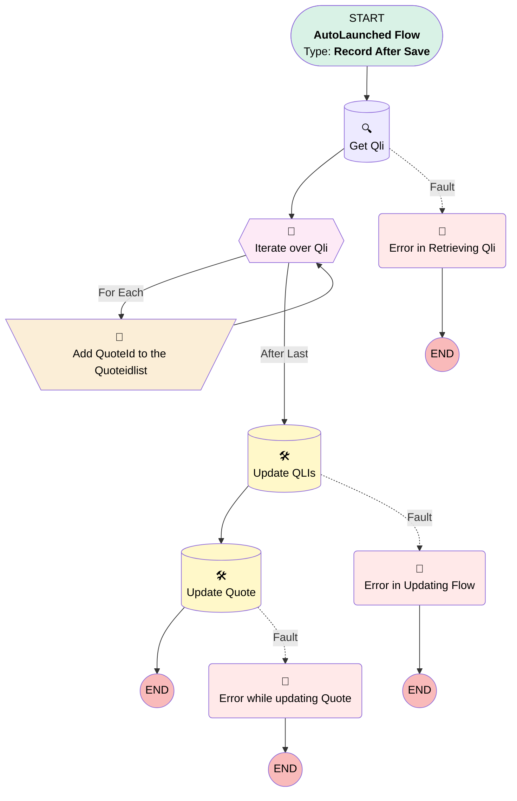

# Product Update Flow

## Flow Diagram [(_View History_)](Product_Update_Flow-history.md)

<!-- Flow description -->

## General Information

|<!-- -->|<!-- -->|
|:---|:---|
|Object|Product2|
|Process Type| Auto Launched Flow|
|Trigger Type| Record After Save|
|Record Trigger Type| Update|
|Label|Product Update Flow|
|Status|Active|
|Description|Added Update Quote fields Specs Updated & status . Also added fault path for all the dml , filter Quote status as Invalid|
|Environments|Default|
|Interview Label|Product Update Flow {!$Flow.CurrentDateTime}|
| Builder Type (PM)|LightningFlowBuilder|
| Canvas Mode (PM)|AUTO_LAYOUT_CANVAS|
| Origin Builder Type (PM)|LightningFlowBuilder|
|Connector|[Get_Qli](#get_qli)|
|Next Node|[Get_Qli](#get_qli)|

## Variables

|Name|Data Type|Is Collection|Is Input|Is Output|Object Type|Description|
|:-- |:--:|:--:|:--:|:--:|:--:|:--  |
|Invalid|Boolean|⬜|⬜|⬜|<!-- -->|<!-- -->|
|QLIList|SObject|✅|⬜|⬜|QuoteLineItem|This is collection variable which holds all the QLI records for further dml operation|
|Quoteidlist|String|✅|✅|✅|<!-- -->|This contains all the  ids of the Quotes whose QLI  are related to the triggering Product Record|
|QuoteLine|SObject|⬜|⬜|⬜|QuoteLineItem|<!-- -->|

## Flow Nodes Details

### Add_QuoteId_to_the_Quoteidlist

|<!-- -->|<!-- -->|
|:---|:---|
|Type|Assignment|
|Label|Add QuoteId to the Quoteidlist|
|Description|In this We store all the Quote ids in collection variable in order to Update it later|
|Connector|[Iterate_over_Qli](#iterate_over_qli)|

#### Assignments

|Assign To Reference|Operator|Value|
|:-- |:--:|:--: |
|QuoteLine| Assign|[Iterate_over_Qli](#iterate_over_qli)|
|QuoteLine.Invalid__c| Assign|✅|
|QLIList| Add|QuoteLine|

### Error_in_Retrieving_Qli

|<!-- -->|<!-- -->|
|:---|:---|
|Type|Custom Error|
|Label|Error in Retrieving Qli|
|Custom Error Messages|errorMessage: '{!$Flow.FaultMessage}' isFieldError: false |

### Error_in_Updating_Flow

|<!-- -->|<!-- -->|
|:---|:---|
|Type|Custom Error|
|Label|Error in Updating Flow|
|Custom Error Messages|errorMessage: '{!$Flow.FaultMessage}' isFieldError: false |

### Error_while_updating_Quote

|<!-- -->|<!-- -->|
|:---|:---|
|Type|Custom Error|
|Label|Error while updating Quote|
|Custom Error Messages|errorMessage: '{!$Flow.FaultMessage}' isFieldError: false |

### Iterate_over_Qli

|<!-- -->|<!-- -->|
|:---|:---|
|Type|Loop|
|Label|Iterate over Qli|
|Description|In this we are Iterating over Qli in order to get the QuoteIDs inside the collection variable for subsequent Update Operation|
|Collection Reference|[Get_Qli](#get_qli)|
|Iteration Order|Asc|
|Next Value Connector|[Add_QuoteId_to_the_Quoteidlist](#add_quoteid_to_the_quoteidlist)|
|No More Values Connector|[Update_QLIs](#update_qlis)|

### Get_Qli

|<!-- -->|<!-- -->|
|:---|:---|
|Type|Record Lookup|
|Object|QuoteLineItem|
|Label|Get Qli|
|Description|In this We are fetching all the Qli related to the Triggering records which will be used for Subsequent operations|
|Assign Null Values If No Records Found|⬜|
|Fault Connector|[Error_in_Retrieving_Qli](#error_in_retrieving_qli)|
|Get First Record Only|⬜|
|Sort Field|QuoteId|
|Sort Order|Asc|
|Store Output Automatically|✅|
|Connector|[Iterate_over_Qli](#iterate_over_qli)|

#### Filters (logic: **and**)

|Filter Id|Field|Operator|Value|
|:-- |:-- |:--:|:--: |
|1|Product2Id| Equal To|$Record.Id|
|2|Quote_Status__c| Not Equal To|Quote Approved|
|3|Quote_Status__c| Not Equal To|Purchasing|
|4|Quote_Status__c| Not Equal To|Invalid|

### Update_QLIs

|<!-- -->|<!-- -->|
|:---|:---|
|Type|Record Update|
|Label|Update QLIs|
|Description|In this we are updating Invalid checkbox on the QLI who are related to the triggering Product record as true|
|Fault Connector|[Error_in_Updating_Flow](#error_in_updating_flow)|
|Input Reference|QLIList|
|Connector|[Update_Quote](#update_quote)|

### Update_Quote

|<!-- -->|<!-- -->|
|:---|:---|
|Type|Record Update|
|Object|Quote|
|Label|Update Quote|
|Description|In this we are updating specs updated checkbox to true & the status as Invalid on the Quote|
|Fault Connector|[Error_while_updating_Quote](#error_while_updating_quote)|

#### Filters (logic: **and**)

|Filter Id|Field|Operator|Value|
|:-- |:-- |:--:|:--: |
|1|Id| In|Quoteidlist|

#### Input Assignments

|Field|Value|
|:-- |:--: |
|Status|Invalid|

___

_Documentation generated from branch main by [sfdx-hardis](https://sfdx-hardis.cloudity.com), featuring [salesforce-flow-visualiser](https://github.com/toddhalfpenny/salesforce-flow-visualiser)_