# Quote Line - Create - Before Save

## Flow Diagram [(_View History_)](Quote_Line_Create_Before_Save-history.md)

```mermaid
%% If you read this, your Markdown visualizer does not handle MermaidJS syntax.
%% - If you are in VsCode, install extension `Markdown Preview Mermaid Support` at https://marketplace.visualstudio.com/items?itemName=bierner.markdown-mermaid
%% - If you are using sfdx-hardis, try to define env variable `MERMAID_MODES=cli,docker` ,then run again the command to regenerate markdown with SVG images.
%% - If you are within mkdocs-material, define mermaid plugin in `mkdocs.yml` as described in https://squidfunk.github.io/mkdocs-material/extensions/mermaid/
%% - At last resort, you can copy-paste this MermaidJS code in https://mermaid.live/ to see the Flow Diagram

flowchart TB
START(["START<br/><b>AutoLaunched Flow</b></br>Type: <b> Record Before Save</b>"]):::startClass
click START "#general-information" "727718347"

Assign_Order_Number_from_Metadata[\"🟰 <em></em><br/>Assign Order Number from Metadata"/]:::assignments
click Assign_Order_Number_from_Metadata "#assign_order_number_from_metadata" "3716254199"

Set_Fields[\"🟰 <em></em><br/>Set Fields"/]:::assignments
click Set_Fields "#set_fields" "2284690141"

Check{"🔀 <em></em><br/>Check OpportunityLineItem"}:::decisions
click Check "#check" "1810127130"

Get_Custom_Metadata[("🔍 <em></em><br/>Get Custom Metadata")]:::recordLookups
click Get_Custom_Metadata "#get_custom_metadata" "3411398646"

Assign_Order_Number_from_Metadata --> END_Assign_Order_Number_from_Metadata
Set_Fields --> Get_Custom_Metadata
Check --> |"Present"| Assign_Order_Number_from_Metadata
Check --> |"Default Outcome"| END_Check
Get_Custom_Metadata --> Check
START -->  Set_Fields
END_Assign_Order_Number_from_Metadata(( END )):::endClass
END_Check(( END )):::endClass


classDef actionCalls fill:#D4E4FC,color:black,text-decoration:none,max-height:100px
classDef assignments fill:#FBEED7,color:black,text-decoration:none,max-height:100px
classDef collectionProcessors fill:#F0E3FA,color:black,text-decoration:none,max-height:100px
classDef customErrors fill:#FFE9E9,color:black,text-decoration:none,max-height:100px
classDef decisions fill:#FDEAF6,color:black,text-decoration:none,max-height:100px
classDef loops fill:#FDEAF6,color:black,text-decoration:none,max-height:100px
classDef recordCreates fill:#FFF8C9,color:black,text-decoration:none,max-height:100px
classDef recordDeletes fill:#FFF8C9,color:black,text-decoration:none,max-height:100px
classDef recordLookups fill:#EDEAFF,color:black,text-decoration:none,max-height:100px
classDef recordUpdates fill:#FFF8C9,color:black,text-decoration:none,max-height:100px
classDef screens fill:#DFF6FF,color:black,text-decoration:none,max-height:100px
classDef subflows fill:#D4E4FC,color:black,text-decoration:none,max-height:100px
classDef startClass fill:#D9F2E6,color:black,text-decoration:none,max-height:100px
classDef endClass fill:#F9BABA,color:black,text-decoration:none,max-height:100px


```

<!-- Flow description -->

## General Information

|<!-- -->|<!-- -->|
|:---|:---|
|Object|QuoteLineItem|
|Process Type| Auto Launched Flow|
|Trigger Type| Record Before Save|
|Record Trigger Type| Create|
|Label|Quote Line - Create - Before Save|
|Status|Active|
|Description|Added custom metadata to update the default order number on quote line item when it's get created from Opportunity.|
|Environments|Default|
|Interview Label|Quote Line Create {!$Flow.CurrentDateTime}|
| Builder Type (PM)|LightningFlowBuilder|
| Canvas Mode (PM)|FREE_FORM_CANVAS|
| Origin Builder Type (PM)|LightningFlowBuilder|
|Connector|[Set_Fields](#set_fields)|
|Next Node|[Set_Fields](#set_fields)|

## Variables

|Name|Data Type|Is Collection|Is Input|Is Output|Object Type|Description|
|:-- |:--:|:--:|:--:|:--:|:--:|:--  |
|allQLIUpdate|SObject|✅|⬜|⬜|QuoteLineItem|<!-- -->|
|OrderNumberVar|Number|⬜|⬜|⬜|<!-- -->|<!-- -->|
|OrderNumQLIRec|SObject|⬜|✅|✅|QuoteLineItem|<!-- -->|

## Flow Nodes Details

### Assign_Order_Number_from_Metadata

|<!-- -->|<!-- -->|
|:---|:---|
|Type|Assignment|
|Label|Assign Order Number from Metadata|

#### Assignments

|Assign To Reference|Operator|Value|
|:-- |:--:|:--: |
|$Record.order_number__c| Assign|Get_Custom_Metadata.order_number__c|

### Set_Fields

|<!-- -->|<!-- -->|
|:---|:---|
|Type|Assignment|
|Label|Set Fields|
|Connector|[Get_Custom_Metadata](#get_custom_metadata)|

#### Assignments

|Assign To Reference|Operator|Value|
|:-- |:--:|:--: |
|$Record.Original_Commission__c| Assign|$Record.PricebookEntry.Commission__c|
|$Record.Commission__c| Assign|$Record.PricebookEntry.Commission__c|
|$Record.ISP__c| Assign|$Record.PricebookEntry.ISP__c|
|$Record.MSRP__c| Assign|$Record.PricebookEntry.MSRP__c|
|$Record.Original_List_Price__c| Assign|$Record.PricebookEntry.UnitPrice|
|$Record.Product_Description_Rich__c| Assign|$Record.Product2.Product_Description_Rich__c|
|$Record.Product_Marketing_Description__c| Assign|$Record.Product2.Product_Marketing_Description__c|
|$Record.Product_Specifications__c| Assign|$Record.Product2.Product_Specifications__c|

### Check

|<!-- -->|<!-- -->|
|:---|:---|
|Type|Decision|
|Label|Check OpportunityLineItem|
|Default Connector Label|Default Outcome|

#### Rule Present (Present)

|<!-- -->|<!-- -->|
|:---|:---|
|Connector|[Assign_Order_Number_from_Metadata](#assign_order_number_from_metadata)|
|Condition Logic|and|

|Condition Id|Left Value Reference|Operator|Right Value|
|:-- |:-- |:--:|:--: |
|1|$Record.OpportunityLineItemId| Is Null|⬜|

### Get_Custom_Metadata

|<!-- -->|<!-- -->|
|:---|:---|
|Type|Record Lookup|
|Object|qliordermapping__mdt|
|Label|Get Custom Metadata|
|Assign Null Values If No Records Found|⬜|
|Get First Record Only|✅|
|Sort Field|DeveloperName|
|Sort Order|Asc|
|Store Output Automatically|✅|
|Connector|[Check](#check)|

#### Filters (logic: **and**)

|Filter Id|Field|Operator|Value|
|:-- |:-- |:--:|:--: |
|1|MasterLabel| Equal To|$Record.Product2.Type__c|

___

_Documentation generated from branch main by [sfdx-hardis](https://sfdx-hardis.cloudity.com), featuring [salesforce-flow-visualiser](https://github.com/toddhalfpenny/salesforce-flow-visualiser)_