# Quote Line - Create or Update - After Save

## Flow Diagram [(_View History_)](Quote_Line_Create_or_Update_After_Save-history.md)

```mermaid
%% If you read this, your Markdown visualizer does not handle MermaidJS syntax.
%% - If you are in VsCode, install extension `Markdown Preview Mermaid Support` at https://marketplace.visualstudio.com/items?itemName=bierner.markdown-mermaid
%% - If you are using sfdx-hardis, try to define env variable `MERMAID_MODES=cli,docker` ,then run again the command to regenerate markdown with SVG images.
%% - If you are within mkdocs-material, define mermaid plugin in `mkdocs.yml` as described in https://squidfunk.github.io/mkdocs-material/extensions/mermaid/
%% - At last resort, you can copy-paste this MermaidJS code in https://mermaid.live/ to see the Flow Diagram

flowchart TB
START(["START<br/><b>AutoLaunched Flow</b></br>Type: <b> Record After Save</b>"]):::startClass
click START "#general-information" "4102135194"

Set_Quote_Line_Fields[\"🟰 <em></em><br/>Set Quote Line Fields"/]:::assignments
click Set_Quote_Line_Fields "#set_quote_line_fields" "4182342871"

Opportunity_Product{"🔀 <em></em><br/>Opportunity Product?"}:::decisions
click Opportunity_Product "#opportunity_product" "3895732036"

Update_Opportunity_Product[("🛠️ <em></em><br/>Update Opportunity Product")]:::recordUpdates
click Update_Opportunity_Product "#update_opportunity_product" "4259590008"

Update_Quote_Line_Item[("🛠️ <em></em><br/>Update Quote Line Item")]:::recordUpdates
click Update_Quote_Line_Item "#update_quote_line_item" "58141146"

Set_Quote_Line_Fields --> Update_Quote_Line_Item
Opportunity_Product --> |"Yes"| Update_Opportunity_Product
Opportunity_Product --> |"No"| END_Opportunity_Product
Update_Opportunity_Product --> END_Update_Opportunity_Product
Update_Quote_Line_Item --> Opportunity_Product
START -->  Set_Quote_Line_Fields
END_Opportunity_Product(( END )):::endClass
END_Update_Opportunity_Product(( END )):::endClass


classDef actionCalls fill:#D4E4FC,color:black,text-decoration:none,max-height:100px
classDef assignments fill:#FBEED7,color:black,text-decoration:none,max-height:100px
classDef collectionProcessors fill:#F0E3FA,color:black,text-decoration:none,max-height:100px
classDef customErrors fill:#FFE9E9,color:black,text-decoration:none,max-height:100px
classDef decisions fill:#FDEAF6,color:black,text-decoration:none,max-height:100px
classDef loops fill:#FDEAF6,color:black,text-decoration:none,max-height:100px
classDef recordCreates fill:#FFF8C9,color:black,text-decoration:none,max-height:100px
classDef recordDeletes fill:#FFF8C9,color:black,text-decoration:none,max-height:100px
classDef recordLookups fill:#EDEAFF,color:black,text-decoration:none,max-height:100px
classDef recordUpdates fill:#FFF8C9,color:black,text-decoration:none,max-height:100px
classDef screens fill:#DFF6FF,color:black,text-decoration:none,max-height:100px
classDef subflows fill:#D4E4FC,color:black,text-decoration:none,max-height:100px
classDef startClass fill:#D9F2E6,color:black,text-decoration:none,max-height:100px
classDef endClass fill:#F9BABA,color:black,text-decoration:none,max-height:100px


```

<!-- Flow description -->

## General Information

|<!-- -->|<!-- -->|
|:---|:---|
|Object|QuoteLineItem|
|Process Type| Auto Launched Flow|
|Trigger Type| Record After Save|
|Record Trigger Type| Create And Update|
|Label|Quote Line - Create or Update - After Save|
|Status|Active|
|Description|This flow is updated to adjust the condition so that when Optional__c  prior value is true & updated to false & Discount_Amount__c is equal to Original_List_Price__c then Discount_Amount__c  should be 0|
|Environments|Default|
|Interview Label|Quote Line - Create or Update - After Save {!$Flow.CurrentDateTime}|
| Builder Type (PM)|LightningFlowBuilder|
| Canvas Mode (PM)|FREE_FORM_CANVAS|
| Origin Builder Type (PM)|LightningFlowBuilder|
|Connector|[Set_Quote_Line_Fields](#set_quote_line_fields)|
|Next Node|[Set_Quote_Line_Fields](#set_quote_line_fields)|

## Formulas

|Name|Data Type|Expression|Description|
|:-- |:--:|:-- |:--  |
|discount|Number|IF(     {!$Record.Optional__c},      {!$Record.Original_List_Price__c},      IF(         AND(             PRIORVALUE({!$Record.Optional__c}),             {!$Record.Discount_Amount__c} = {!$Record.Original_List_Price__c}         ),          0,          IF(             !ISBLANK({!$Record.Discount_Amount__c}) || {!$Record.Discount_Amount__c} > 0,              {!$Record.Discount_Amount__c},              0         )     ) )|<!-- -->|
|unitPrice|Currency|{!$Record.Original_List_Price__c} - {!discount}|<!-- -->|

## Flow Nodes Details

### Set_Quote_Line_Fields

|<!-- -->|<!-- -->|
|:---|:---|
|Type|Assignment|
|Label|Set Quote Line Fields|
|Connector|[Update_Quote_Line_Item](#update_quote_line_item)|

#### Assignments

|Assign To Reference|Operator|Value|
|:-- |:--:|:--: |
|$Record.Discount_Amount__c| Assign|discount|
|$Record.UnitPrice| Assign|unitPrice|

### Opportunity_Product

|<!-- -->|<!-- -->|
|:---|:---|
|Type|Decision|
|Label|Opportunity Product?|
|Default Connector Label|No|

#### Rule Yes (Yes)

|<!-- -->|<!-- -->|
|:---|:---|
|Connector|[Update_Opportunity_Product](#update_opportunity_product)|
|Condition Logic|and|

|Condition Id|Left Value Reference|Operator|Right Value|
|:-- |:-- |:--:|:--: |
|1|$Record.OpportunityLineItemId| Is Null|⬜|

### Update_Opportunity_Product

|<!-- -->|<!-- -->|
|:---|:---|
|Type|Record Update|
|Object|OpportunityLineItem|
|Label|Update Opportunity Product|

#### Filters (logic: **and**)

|Filter Id|Field|Operator|Value|
|:-- |:-- |:--:|:--: |
|1|Id| Equal To|$Record.OpportunityLineItemId|

#### Input Assignments

|Field|Value|
|:-- |:--: |
|Optional__c|$Record.Optional__c|

### Update_Quote_Line_Item

|<!-- -->|<!-- -->|
|:---|:---|
|Type|Record Update|
|Label|Update Quote Line Item|
|Input Reference|$Record|
|Connector|[Opportunity_Product](#opportunity_product)|

___

_Documentation generated from branch main by [sfdx-hardis](https://sfdx-hardis.cloudity.com), featuring [salesforce-flow-visualiser](https://github.com/toddhalfpenny/salesforce-flow-visualiser)_