# Update Has Contact Role on Opp

## Flow Diagram [(_View History_)](Update_Has_Contact_Role_on_Opp-history.md)

```mermaid
%% If you read this, your Markdown visualizer does not handle MermaidJS syntax.
%% - If you are in VsCode, install extension `Markdown Preview Mermaid Support` at https://marketplace.visualstudio.com/items?itemName=bierner.markdown-mermaid
%% - If you are using sfdx-hardis, try to define env variable `MERMAID_MODES=cli,docker` ,then run again the command to regenerate markdown with SVG images.
%% - If you are within mkdocs-material, define mermaid plugin in `mkdocs.yml` as described in https://squidfunk.github.io/mkdocs-material/extensions/mermaid/
%% - At last resort, you can copy-paste this MermaidJS code in https://mermaid.live/ to see the Flow Diagram

flowchart TB
START(["START<br/><b>AutoLaunched Flow</b></br>Type: <b> Record After Save</b>"]):::startClass
click START "#general-information" "1214055699"

Check_Role{"🔀 <em></em><br/>Check Role"}:::decisions
click Check_Role "#check_role" "1534689278"

Update[("🛠️ <em></em><br/>Update Contact Role EDM checkbox on Opportunity")]:::recordUpdates
click Update "#update" "935446430"

Update_Has_Contact_Role_Check[("🛠️ <em></em><br/>Update Has Contact Role Check")]:::recordUpdates
click Update_Has_Contact_Role_Check "#update_has_contact_role_check" "2775638134"

Update_Opportunity[("🛠️ <em></em><br/>Update Opportunity")]:::recordUpdates
click Update_Opportunity "#update_opportunity" "2773918692"

Check_Role --> |"Role = DM"| Update_Has_Contact_Role_Check
Check_Role --> |"Role = EDM"| Update
Check_Role --> |"Role is DM and EDM"| Update_Opportunity
Check_Role --> |"Default Outcome"| END_Check_Role
Update --> END_Update
Update_Has_Contact_Role_Check --> END_Update_Has_Contact_Role_Check
Update_Opportunity --> END_Update_Opportunity
START -->  Check_Role
END_Check_Role(( END )):::endClass
END_Update(( END )):::endClass
END_Update_Has_Contact_Role_Check(( END )):::endClass
END_Update_Opportunity(( END )):::endClass


classDef actionCalls fill:#D4E4FC,color:black,text-decoration:none,max-height:100px
classDef assignments fill:#FBEED7,color:black,text-decoration:none,max-height:100px
classDef collectionProcessors fill:#F0E3FA,color:black,text-decoration:none,max-height:100px
classDef customErrors fill:#FFE9E9,color:black,text-decoration:none,max-height:100px
classDef decisions fill:#FDEAF6,color:black,text-decoration:none,max-height:100px
classDef loops fill:#FDEAF6,color:black,text-decoration:none,max-height:100px
classDef recordCreates fill:#FFF8C9,color:black,text-decoration:none,max-height:100px
classDef recordDeletes fill:#FFF8C9,color:black,text-decoration:none,max-height:100px
classDef recordLookups fill:#EDEAFF,color:black,text-decoration:none,max-height:100px
classDef recordUpdates fill:#FFF8C9,color:black,text-decoration:none,max-height:100px
classDef screens fill:#DFF6FF,color:black,text-decoration:none,max-height:100px
classDef subflows fill:#D4E4FC,color:black,text-decoration:none,max-height:100px
classDef startClass fill:#D9F2E6,color:black,text-decoration:none,max-height:100px
classDef endClass fill:#F9BABA,color:black,text-decoration:none,max-height:100px


```

<!-- Flow description -->

## General Information

|<!-- -->|<!-- -->|
|:---|:---|
|Object|OpportunityContactRole|
|Process Type| Auto Launched Flow|
|Trigger Type| Record After Save|
|Record Trigger Type| Create And Update|
|Label|Update Has Contact Role on Opp|
|Status|Active|
|Environments|Default|
|Interview Label|Update Has Contact Role on Opp {!$Flow.CurrentDateTime}|
| Builder Type (PM)|LightningFlowBuilder|
| Canvas Mode (PM)|FREE_FORM_CANVAS|
| Origin Builder Type (PM)|LightningFlowBuilder|
|Connector|[Check_Role](#check_role)|
|Next Node|[Check_Role](#check_role)|

#### Filters (logic: **or**)

|Filter Id|Field|Operator|Value|
|:-- |:-- |:--:|:--: |
|1|Role| Equal To|Decision Maker|
|2|Role| Equal To|Economic Decision Maker|

## Flow Nodes Details

### Check_Role

|<!-- -->|<!-- -->|
|:---|:---|
|Type|Decision|
|Label|Check Role|
|Description|This decision will check the role then update Opportunity checkbox|
|Default Connector Label|Default Outcome|

#### Rule Role_DM (Role = DM)

|<!-- -->|<!-- -->|
|:---|:---|
|Connector|[Update_Has_Contact_Role_Check](#update_has_contact_role_check)|
|Condition Logic|and|

|Condition Id|Left Value Reference|Operator|Right Value|
|:-- |:-- |:--:|:--: |
|1|$Record.Role| Equal To|Decision Maker|

#### Rule Role_EDM (Role = EDM)

|<!-- -->|<!-- -->|
|:---|:---|
|Connector|[Update](#update)|
|Condition Logic|and|

|Condition Id|Left Value Reference|Operator|Right Value|
|:-- |:-- |:--:|:--: |
|1|$Record.Role| Equal To|Economic Decision Maker|

#### Rule Role_is_DM_and_EDM (Role is DM and EDM)

|<!-- -->|<!-- -->|
|:---|:---|
|Connector|[Update_Opportunity](#update_opportunity)|
|Condition Logic|and|

|Condition Id|Left Value Reference|Operator|Right Value|
|:-- |:-- |:--:|:--: |
|1|$Record.Role| Equal To|Decision Maker|
|2|$Record.Role| Equal To|Economic Decision Maker|

### Update

|<!-- -->|<!-- -->|
|:---|:---|
|Type|Record Update|
|Object|Opportunity|
|Label|Update Contact Role EDM checkbox on Opportunity|

#### Filters (logic: **and**)

|Filter Id|Field|Operator|Value|
|:-- |:-- |:--:|:--: |
|1|Id| Equal To|$Record.OpportunityId|

#### Input Assignments

|Field|Value|
|:-- |:--: |
|Contact_Role_EDM__c|✅|

### Update_Has_Contact_Role_Check

|<!-- -->|<!-- -->|
|:---|:---|
|Type|Record Update|
|Object|Opportunity|
|Label|Update Has Contact Role Check|

#### Filters (logic: **and**)

|Filter Id|Field|Operator|Value|
|:-- |:-- |:--:|:--: |
|1|Id| Equal To|$Record.OpportunityId|

#### Input Assignments

|Field|Value|
|:-- |:--: |
|Has_Contact_Role_as_DM__c|✅|

### Update_Opportunity

|<!-- -->|<!-- -->|
|:---|:---|
|Type|Record Update|
|Object|Opportunity|
|Label|Update Opportunity|

#### Filters (logic: **and**)

|Filter Id|Field|Operator|Value|
|:-- |:-- |:--:|:--: |
|1|Id| Equal To|$Record.OpportunityId|

#### Input Assignments

|Field|Value|
|:-- |:--: |
|Contact_Role_EDM__c|✅|
|Has_Contact_Role_as_DM__c|✅|

___

_Documentation generated from branch main by [sfdx-hardis](https://sfdx-hardis.cloudity.com), featuring [salesforce-flow-visualiser](https://github.com/toddhalfpenny/salesforce-flow-visualiser)_