# Update Lost Reason and Post Mortem to Blank

## Flow Diagram [(_View History_)](Update_Lost_Reason_and_Post_Mortem_to_Blank-history.md)

```mermaid
%% If you read this, your Markdown visualizer does not handle MermaidJS syntax.
%% - If you are in VsCode, install extension `Markdown Preview Mermaid Support` at https://marketplace.visualstudio.com/items?itemName=bierner.markdown-mermaid
%% - If you are using sfdx-hardis, try to define env variable `MERMAID_MODES=cli,docker` ,then run again the command to regenerate markdown with SVG images.
%% - If you are within mkdocs-material, define mermaid plugin in `mkdocs.yml` as described in https://squidfunk.github.io/mkdocs-material/extensions/mermaid/
%% - At last resort, you can copy-paste this MermaidJS code in https://mermaid.live/ to see the Flow Diagram

flowchart TB
START(["START<br/><b>AutoLaunched Flow</b></br>Type: <b> Record Before Save</b>"]):::startClass
click START "#general-information" "1983125327"

Check_Previuos_Stage_is_Closed_Lost{"🔀 <em></em><br/>Check Previuos Stage is Closed Lost"}:::decisions
click Check_Previuos_Stage_is_Closed_Lost "#check_previuos_stage_is_closed_lost" "3916011692"

Update_Lost_Reason_and_Notes_Post_Mortem_to_Blank[("🛠️ <em></em><br/>Update Lost Reason and Notes Post Mortem to Blank")]:::recordUpdates
click Update_Lost_Reason_and_Notes_Post_Mortem_to_Blank "#update_lost_reason_and_notes_post_mortem_to_blank" "2053323641"

Check_Previuos_Stage_is_Closed_Lost --> |"Yes, Previous Stage is Closed Lost"| Update_Lost_Reason_and_Notes_Post_Mortem_to_Blank
Check_Previuos_Stage_is_Closed_Lost --> |"No"| END_Check_Previuos_Stage_is_Closed_Lost
Update_Lost_Reason_and_Notes_Post_Mortem_to_Blank --> END_Update_Lost_Reason_and_Notes_Post_Mortem_to_Blank
START -->  Check_Previuos_Stage_is_Closed_Lost
END_Check_Previuos_Stage_is_Closed_Lost(( END )):::endClass
END_Update_Lost_Reason_and_Notes_Post_Mortem_to_Blank(( END )):::endClass


classDef actionCalls fill:#D4E4FC,color:black,text-decoration:none,max-height:100px
classDef assignments fill:#FBEED7,color:black,text-decoration:none,max-height:100px
classDef collectionProcessors fill:#F0E3FA,color:black,text-decoration:none,max-height:100px
classDef customErrors fill:#FFE9E9,color:black,text-decoration:none,max-height:100px
classDef decisions fill:#FDEAF6,color:black,text-decoration:none,max-height:100px
classDef loops fill:#FDEAF6,color:black,text-decoration:none,max-height:100px
classDef recordCreates fill:#FFF8C9,color:black,text-decoration:none,max-height:100px
classDef recordDeletes fill:#FFF8C9,color:black,text-decoration:none,max-height:100px
classDef recordLookups fill:#EDEAFF,color:black,text-decoration:none,max-height:100px
classDef recordUpdates fill:#FFF8C9,color:black,text-decoration:none,max-height:100px
classDef screens fill:#DFF6FF,color:black,text-decoration:none,max-height:100px
classDef subflows fill:#D4E4FC,color:black,text-decoration:none,max-height:100px
classDef startClass fill:#D9F2E6,color:black,text-decoration:none,max-height:100px
classDef endClass fill:#F9BABA,color:black,text-decoration:none,max-height:100px


```

<!-- Flow description -->

## General Information

|<!-- -->|<!-- -->|
|:---|:---|
|Object|Opportunity|
|Process Type| Auto Launched Flow|
|Trigger Type| Record Before Save|
|Record Trigger Type| Update|
|Label|Update Lost Reason and Post Mortem to Blank|
|Status|Active|
|Environments|Default|
|Interview Label|Update Lost Reason and Post MortomClosed Lost {!$Flow.CurrentDateTime}|
| Builder Type (PM)|LightningFlowBuilder|
| Canvas Mode (PM)|AUTO_LAYOUT_CANVAS|
| Origin Builder Type (PM)|LightningFlowBuilder|
|Connector|[Check_Previuos_Stage_is_Closed_Lost](#check_previuos_stage_is_closed_lost)|
|Next Node|[Check_Previuos_Stage_is_Closed_Lost](#check_previuos_stage_is_closed_lost)|

#### Filters (logic: **and**)

|Filter Id|Field|Operator|Value|
|:-- |:-- |:--:|:--: |
|1|StageName| Is Changed|✅|

## Flow Nodes Details

### Check_Previuos_Stage_is_Closed_Lost

|<!-- -->|<!-- -->|
|:---|:---|
|Type|Decision|
|Label|Check Previuos Stage is Closed Lost|
|Description|It checks whether prior stage is closed lost or not|
|Default Connector Label|No|

#### Rule Yes_Previous_Stage_is_Closed_Lost (Yes, Previous Stage is Closed Lost)

|<!-- -->|<!-- -->|
|:---|:---|
|Connector|[Update_Lost_Reason_and_Notes_Post_Mortem_to_Blank](#update_lost_reason_and_notes_post_mortem_to_blank)|
|Condition Logic|and|

|Condition Id|Left Value Reference|Operator|Right Value|
|:-- |:-- |:--:|:--: |
|1|$Record__Prior.StageName| Equal To|Closed Lost|
|2|$Record.StageName| Not Equal To|$Record__Prior.StageName|

### Update_Lost_Reason_and_Notes_Post_Mortem_to_Blank

|<!-- -->|<!-- -->|
|:---|:---|
|Type|Record Update|
|Label|Update Lost Reason and Notes Post Mortem to Blank|
|Description|This updates Lost Reason and Notes Post Mortem to Blank|
|Input Reference|$Record|

#### Input Assignments

|Field|Value|
|:-- |:--: |
|Lost_Reason__c|stringValue: '' |
|Notes_Post_Mortem__c|⬜|

___

_Documentation generated from branch main by [sfdx-hardis](https://sfdx-hardis.cloudity.com), featuring [salesforce-flow-visualiser](https://github.com/toddhalfpenny/salesforce-flow-visualiser)_