# Update Opportunity Stage based on Criteria

## Flow Diagram [(_View History_)](Update_Opportunity_Stage_based_on_Criteria-history.md)

```mermaid
%% If you read this, your Markdown visualizer does not handle MermaidJS syntax.
%% - If you are in VsCode, install extension `Markdown Preview Mermaid Support` at https://marketplace.visualstudio.com/items?itemName=bierner.markdown-mermaid
%% - If you are using sfdx-hardis, try to define env variable `MERMAID_MODES=cli,docker` ,then run again the command to regenerate markdown with SVG images.
%% - If you are within mkdocs-material, define mermaid plugin in `mkdocs.yml` as described in https://squidfunk.github.io/mkdocs-material/extensions/mermaid/
%% - At last resort, you can copy-paste this MermaidJS code in https://mermaid.live/ to see the Flow Diagram

flowchart TB
START(["START<br/><b>AutoLaunched Flow</b></br>Type: <b> Record After Save</b>"]):::startClass
click START "#general-information" "3231658401"

Check_Closed_Lost_OR_Qualification_Open{"🔀 <em></em><br/>Check Closed Lost OR Qualification Open"}:::decisions
click Check_Closed_Lost_OR_Qualification_Open "#check_closed_lost_or_qualification_open" "145491887"

Check_lost_reason_check{"🔀 <em></em><br/>Check lost reason check"}:::decisions
click Check_lost_reason_check "#check_lost_reason_check" "4211295357"

Check_Qualification_Open{"🔀 <em></em><br/>Check Qualification Open"}:::decisions
click Check_Qualification_Open "#check_qualification_open" "1025165503"

Check_Stages{"🔀 <em></em><br/>Check for Stages"}:::decisions
click Check_Stages "#check_stages" "1781644690"

Check_stages_for_OPT_out_stage{"🔀 <em></em><br/>Check stages for OPT out stage"}:::decisions
click Check_stages_for_OPT_out_stage "#check_stages_for_opt_out_stage" "2143286211"

Is_Record_Type_is_Commercial{"🔀 <em></em><br/>Is Record Type is Commercial"}:::decisions
click Is_Record_Type_is_Commercial "#is_record_type_is_commercial" "2626656005"

Opt_Out_stage_Check{"🔀 <em></em><br/>Opt Out stage Check"}:::decisions
click Opt_Out_stage_Check "#opt_out_stage_check" "1651747938"

Get_Record_Id[("🔍 <em></em><br/>Get Record Id")]:::recordLookups
click Get_Record_Id "#get_record_id" "3327078178"

Contacted_by_Purchasing[("🛠️ <em></em><br/>Contacted by Purchasing")]:::recordUpdates
click Contacted_by_Purchasing "#contacted_by_purchasing" "1564523026"

Need_By_Date_Known[("🛠️ <em></em><br/>Need By Date Known")]:::recordUpdates
click Need_By_Date_Known "#need_by_date_known" "2994484318"

Order_Sent_Quoted_to_Purchasing[("🛠️ <em></em><br/>Order Sent/Quoted to Purchasing")]:::recordUpdates
click Order_Sent_Quoted_to_Purchasing "#order_sent_quoted_to_purchasing" "4212543125"

Update_Opportunity_Stage_Decision_Maker_Confirmed[("🛠️ <em></em><br/>Update Opportunity Stage Decision Maker Confirmed")]:::recordUpdates
click Update_Opportunity_Stage_Decision_Maker_Confirmed "#update_opportunity_stage_decision_maker_confirmed" "2990577729"

Update_Product_Fit_Confirm_Confirm[("🛠️ <em></em><br/>Update Product Fit Confirm Confirm")]:::recordUpdates
click Update_Product_Fit_Confirm_Confirm "#update_product_fit_confirm_confirm" "1902452237"

Update_Qualification_Open[("🛠️ <em></em><br/>Update Qualification Open")]:::recordUpdates
click Update_Qualification_Open "#update_qualification_open" "105523667"

Update_Stage_to_Application_Fit_Confirmed[("🛠️ <em></em><br/>Update Stage to Application Fit Confirmed")]:::recordUpdates
click Update_Stage_to_Application_Fit_Confirmed "#update_stage_to_application_fit_confirmed" "3429755109"

Update_Stage_to_Application_Fit_Confirmed_OptOut[("🛠️ <em></em><br/>Update Stage to Application Fit Confirmed")]:::recordUpdates
click Update_Stage_to_Application_Fit_Confirmed_OptOut "#update_stage_to_application_fit_confirmed_optout" "2140366214"

Update_stage_to_Budget_Fit_Confirmed[("🛠️ <em></em><br/>Update stage to Budget Fit Confirmed")]:::recordUpdates
click Update_stage_to_Budget_Fit_Confirmed "#update_stage_to_budget_fit_confirmed" "1893901757"

Update_stage_to_closed_lost[("🛠️ <em></em><br/>Update stage to closed lost")]:::recordUpdates
click Update_stage_to_closed_lost "#update_stage_to_closed_lost" "1405627287"

Update_Stage_to_Closed_Won[("🛠️ <em></em><br/>Update Stage to Closed Won")]:::recordUpdates
click Update_Stage_to_Closed_Won "#update_stage_to_closed_won" "2405043518"

Update_Stage_to_Contact_Approval[("🛠️ <em></em><br/>Update Stage to Contact Approval")]:::recordUpdates
click Update_Stage_to_Contact_Approval "#update_stage_to_contact_approval" "95911793"

Update_stage_to_Contacted_by_Purchasing1[("🛠️ <em></em><br/>Update stage to Contacted by Purchasing")]:::recordUpdates
click Update_stage_to_Contacted_by_Purchasing1 "#update_stage_to_contacted_by_purchasing1" "2641641505"

Update_stage_to_Contract_Approval1[("🛠️ <em></em><br/>Update stage to Contract Approval")]:::recordUpdates
click Update_stage_to_Contract_Approval1 "#update_stage_to_contract_approval1" "650282925"

Update_Stage_to_Funded[("🛠️ <em></em><br/>Update Stage to Funded")]:::recordUpdates
click Update_Stage_to_Funded "#update_stage_to_funded" "306446618"

Update_Stage_to_funded_in_OPT_stage[("🛠️ <em></em><br/>Update Stage to funded in OPT stage")]:::recordUpdates
click Update_Stage_to_funded_in_OPT_stage "#update_stage_to_funded_in_opt_stage" "3139017682"

Update_Stage_to_Need_by_Date_known1[("🛠️ <em></em><br/>Update Stage to Need by Date known")]:::recordUpdates
click Update_Stage_to_Need_by_Date_known1 "#update_stage_to_need_by_date_known1" "1358509797"

Update_stage_to_Order_Sent_Quoted_to_Purchasing1[("🛠️ <em></em><br/>Update stage to Order Sent/Quoted to Purchasing")]:::recordUpdates
click Update_stage_to_Order_Sent_Quoted_to_Purchasing1 "#update_stage_to_order_sent_quoted_to_purchasing1" "3483833861"

Check_Closed_Lost_OR_Qualification_Open --> |"Check for closed won checkbox is true"| Update_Stage_to_Closed_Won
Check_Closed_Lost_OR_Qualification_Open --> |"Check Lost Reason & Notes(Post Morterm)"| Update_stage_to_closed_lost
Check_Closed_Lost_OR_Qualification_Open --> |"Default Outcome"| Update_Qualification_Open
Check_lost_reason_check --> |"Lost Reason not null"| Update_stage_to_closed_lost
Check_lost_reason_check --> |"Default Outcome"| END_Check_lost_reason_check
Check_Qualification_Open --> |"Some fields not present"| Check_Closed_Lost_OR_Qualification_Open
Check_Qualification_Open --> |"Default"| Opt_Out_stage_Check
Check_Stages --> |"Check for closed won is true"| Update_Stage_to_Closed_Won
Check_Stages --> |"Closed Lost Check"| Check_lost_reason_check
Check_Stages --> |"Closed Won Stage"| Update_Stage_to_Closed_Won
Check_Stages --> |"Contact Approval"| Update_Stage_to_Contact_Approval
Check_Stages --> |"Contacted by Purchasing Stage"| Contacted_by_Purchasing
Check_Stages --> |"Order Sent/Quoted to Purchasing Stage"| Order_Sent_Quoted_to_Purchasing
Check_Stages --> |"Need By Date Known Stage"| Need_By_Date_Known
Check_Stages --> |"Funded Stage"| Update_Stage_to_Funded
Check_Stages --> |"Application Fit Confirmed Stage"| Update_Stage_to_Application_Fit_Confirmed
Check_Stages --> |"Budget Fit Confirmed Stage"| Update_stage_to_Budget_Fit_Confirmed
Check_Stages --> |"Decision Maker Confirmed Stage"| Update_Opportunity_Stage_Decision_Maker_Confirmed
Check_Stages --> |"Product Fit Confirmed Stage"| Update_Product_Fit_Confirm_Confirm
Check_Stages --> |"Default Outcome"| END_Check_Stages
Check_stages_for_OPT_out_stage --> |"Budget fit to Application fit"| Update_Stage_to_Application_Fit_Confirmed_OptOut
Check_stages_for_OPT_out_stage --> |"Application to Funded"| Update_Stage_to_funded_in_OPT_stage
Check_stages_for_OPT_out_stage --> |"Funded to Need by date"| Update_Stage_to_Need_by_Date_known1
Check_stages_for_OPT_out_stage --> |"Need by date to Order Sent/Quoted to Purchasing"| Update_stage_to_Order_Sent_Quoted_to_Purchasing1
Check_stages_for_OPT_out_stage --> |"Order Sent/Quoted to Purchasing to Contacted by Purchasing"| Update_stage_to_Contacted_by_Purchasing1
Check_stages_for_OPT_out_stage --> |"Contacted by Purchasing to Contract Approval"| Update_stage_to_Contract_Approval1
Check_stages_for_OPT_out_stage --> |"Default Outcome"| END_Check_stages_for_OPT_out_stage
Is_Record_Type_is_Commercial --> |"Record Type is Commercial"| Check_Qualification_Open
Is_Record_Type_is_Commercial --> |"Record Type is not Commercial"| END_Is_Record_Type_is_Commercial
Opt_Out_stage_Check --> |"Opt stage = false"| Check_Stages
Opt_Out_stage_Check --> |"Default Outcome"| Check_stages_for_OPT_out_stage
Get_Record_Id --> Is_Record_Type_is_Commercial
Contacted_by_Purchasing --> END_Contacted_by_Purchasing
Need_By_Date_Known --> END_Need_By_Date_Known
Order_Sent_Quoted_to_Purchasing --> END_Order_Sent_Quoted_to_Purchasing
Update_Opportunity_Stage_Decision_Maker_Confirmed --> END_Update_Opportunity_Stage_Decision_Maker_Confirmed
Update_Product_Fit_Confirm_Confirm --> END_Update_Product_Fit_Confirm_Confirm
Update_Qualification_Open --> END_Update_Qualification_Open
Update_Stage_to_Application_Fit_Confirmed --> END_Update_Stage_to_Application_Fit_Confirmed
Update_Stage_to_Application_Fit_Confirmed_OptOut --> END_Update_Stage_to_Application_Fit_Confirmed_OptOut
Update_stage_to_Budget_Fit_Confirmed --> END_Update_stage_to_Budget_Fit_Confirmed
Update_stage_to_closed_lost --> END_Update_stage_to_closed_lost
Update_Stage_to_Closed_Won --> END_Update_Stage_to_Closed_Won
Update_Stage_to_Contact_Approval --> END_Update_Stage_to_Contact_Approval
Update_stage_to_Contacted_by_Purchasing1 --> END_Update_stage_to_Contacted_by_Purchasing1
Update_stage_to_Contract_Approval1 --> END_Update_stage_to_Contract_Approval1
Update_Stage_to_Funded --> END_Update_Stage_to_Funded
Update_Stage_to_funded_in_OPT_stage --> END_Update_Stage_to_funded_in_OPT_stage
Update_Stage_to_Need_by_Date_known1 --> END_Update_Stage_to_Need_by_Date_known1
Update_stage_to_Order_Sent_Quoted_to_Purchasing1 --> END_Update_stage_to_Order_Sent_Quoted_to_Purchasing1
START -->  Get_Record_Id
END_Check_lost_reason_check(( END )):::endClass
END_Check_Stages(( END )):::endClass
END_Check_stages_for_OPT_out_stage(( END )):::endClass
END_Is_Record_Type_is_Commercial(( END )):::endClass
END_Contacted_by_Purchasing(( END )):::endClass
END_Need_By_Date_Known(( END )):::endClass
END_Order_Sent_Quoted_to_Purchasing(( END )):::endClass
END_Update_Opportunity_Stage_Decision_Maker_Confirmed(( END )):::endClass
END_Update_Product_Fit_Confirm_Confirm(( END )):::endClass
END_Update_Qualification_Open(( END )):::endClass
END_Update_Stage_to_Application_Fit_Confirmed(( END )):::endClass
END_Update_Stage_to_Application_Fit_Confirmed_OptOut(( END )):::endClass
END_Update_stage_to_Budget_Fit_Confirmed(( END )):::endClass
END_Update_stage_to_closed_lost(( END )):::endClass
END_Update_Stage_to_Closed_Won(( END )):::endClass
END_Update_Stage_to_Contact_Approval(( END )):::endClass
END_Update_stage_to_Contacted_by_Purchasing1(( END )):::endClass
END_Update_stage_to_Contract_Approval1(( END )):::endClass
END_Update_Stage_to_Funded(( END )):::endClass
END_Update_Stage_to_funded_in_OPT_stage(( END )):::endClass
END_Update_Stage_to_Need_by_Date_known1(( END )):::endClass
END_Update_stage_to_Order_Sent_Quoted_to_Purchasing1(( END )):::endClass


classDef actionCalls fill:#D4E4FC,color:black,text-decoration:none,max-height:100px
classDef assignments fill:#FBEED7,color:black,text-decoration:none,max-height:100px
classDef collectionProcessors fill:#F0E3FA,color:black,text-decoration:none,max-height:100px
classDef customErrors fill:#FFE9E9,color:black,text-decoration:none,max-height:100px
classDef decisions fill:#FDEAF6,color:black,text-decoration:none,max-height:100px
classDef loops fill:#FDEAF6,color:black,text-decoration:none,max-height:100px
classDef recordCreates fill:#FFF8C9,color:black,text-decoration:none,max-height:100px
classDef recordDeletes fill:#FFF8C9,color:black,text-decoration:none,max-height:100px
classDef recordLookups fill:#EDEAFF,color:black,text-decoration:none,max-height:100px
classDef recordUpdates fill:#FFF8C9,color:black,text-decoration:none,max-height:100px
classDef screens fill:#DFF6FF,color:black,text-decoration:none,max-height:100px
classDef subflows fill:#D4E4FC,color:black,text-decoration:none,max-height:100px
classDef startClass fill:#D9F2E6,color:black,text-decoration:none,max-height:100px
classDef endClass fill:#F9BABA,color:black,text-decoration:none,max-height:100px


```

<!-- Flow description -->

## General Information

|<!-- -->|<!-- -->|
|:---|:---|
|Object|Opportunity|
|Process Type| Auto Launched Flow|
|Trigger Type| Record After Save|
|Record Trigger Type| Create And Update|
|Label|Update Opportunity Stage based on Criteria|
|Status|Active|
|Description|This flow is checking required fields before update Stage on Opportunity + Update Closed Lost or Qualification Open + updated 17 May 24 + Added condition for For Closed won checkbox v2|
|Environments|Default|
|Interview Label|Update Opportunity Stage based on Criteria {!$Flow.CurrentDateTime}|
| Builder Type (PM)|LightningFlowBuilder|
| Canvas Mode (PM)|FREE_FORM_CANVAS|
| Origin Builder Type (PM)|LightningFlowBuilder|
|Connector|[Get_Record_Id](#get_record_id)|
|Next Node|[Get_Record_Id](#get_record_id)|

## Variables

|Name|Data Type|Is Collection|Is Input|Is Output|Object Type|Description|
|:-- |:--:|:--:|:--:|:--:|:--:|:--  |
|ProductFitConfirmedCheckVar|Boolean|⬜|✅|✅|<!-- -->|<!-- -->|
|QualificationCheck|Boolean|⬜|✅|✅|<!-- -->|<!-- -->|
|recordTypeDeveloperName|String|⬜|✅|✅|<!-- -->|<!-- -->|

## Flow Nodes Details

### Check_Closed_Lost_OR_Qualification_Open

|<!-- -->|<!-- -->|
|:---|:---|
|Type|Decision|
|Label|Check Closed Lost OR Qualification Open|
|Default Connector|[Update_Qualification_Open](#update_qualification_open)|
|Default Connector Label|Default Outcome|

#### Rule Check_for_closed_won_checkbox_is_true (Check for closed won checkbox is true)

|<!-- -->|<!-- -->|
|:---|:---|
|Connector|[Update_Stage_to_Closed_Won](#update_stage_to_closed_won)|
|Condition Logic|and|

|Condition Id|Left Value Reference|Operator|Right Value|
|:-- |:-- |:--:|:--: |
|1|$Record.For_Closed_Won__c| Equal To|✅|

#### Rule Check_Lost_Reason_Notes_Post_Morterm (Check Lost Reason & Notes(Post Morterm))

|<!-- -->|<!-- -->|
|:---|:---|
|Connector|[Update_stage_to_closed_lost](#update_stage_to_closed_lost)|
|Condition Logic|and|

|Condition Id|Left Value Reference|Operator|Right Value|
|:-- |:-- |:--:|:--: |
|1|$Record.Lost_Reason__c| Is Null|⬜|
|2|$Record.Notes_Post_Mortem__c| Equal To|✅|

### Check_lost_reason_check

|<!-- -->|<!-- -->|
|:---|:---|
|Type|Decision|
|Label|Check lost reason check|
|Default Connector Label|Default Outcome|

#### Rule Lost_Reason_not_null (Lost Reason not null)

|<!-- -->|<!-- -->|
|:---|:---|
|Connector|[Update_stage_to_closed_lost](#update_stage_to_closed_lost)|
|Condition Logic|and|

|Condition Id|Left Value Reference|Operator|Right Value|
|:-- |:-- |:--:|:--: |
|1|$Record.Lost_Reason__c| Is Null|⬜|

### Check_Qualification_Open

|<!-- -->|<!-- -->|
|:---|:---|
|Type|Decision|
|Label|Check Qualification Open|
|Description|This is use to set up qualification open stage|
|Default Connector|[Opt_Out_stage_Check](#opt_out_stage_check)|
|Default Connector Label|Default|

#### Rule Some_fields_not_present (Some fields not present)

|<!-- -->|<!-- -->|
|:---|:---|
|Connector|[Check_Closed_Lost_OR_Qualification_Open](#check_closed_lost_or_qualification_open)|
|Condition Logic|or|

|Condition Id|Left Value Reference|Operator|Right Value|
|:-- |:-- |:--:|:--: |
|1|$Record.Name| Is Null|✅|
|2|$Record.Account.Name| Is Null|✅|
|3|$Record.LOB__c| Is Null|✅|
|4|$Record.Market_Segment__c| Is Null|✅|

### Check_Stages

|<!-- -->|<!-- -->|
|:---|:---|
|Type|Decision|
|Label|Check for Stages|
|Default Connector Label|Default Outcome|

#### Rule Check_for_closed_won_is_true (Check for closed won is true)

|<!-- -->|<!-- -->|
|:---|:---|
|Connector|[Update_Stage_to_Closed_Won](#update_stage_to_closed_won)|
|Condition Logic|and|

|Condition Id|Left Value Reference|Operator|Right Value|
|:-- |:-- |:--:|:--: |
|1|$Record.For_Closed_Won__c| Equal To|✅|

#### Rule Closed_Lost_Check_1 (Closed Lost Check)

|<!-- -->|<!-- -->|
|:---|:---|
|Connector|[Check_lost_reason_check](#check_lost_reason_check)|
|Condition Logic|and|

|Condition Id|Left Value Reference|Operator|Right Value|
|:-- |:-- |:--:|:--: |
|1|$Record.Notes_Post_Mortem__c| Equal To|✅|

#### Rule Closed_Won_Stage (Closed Won Stage)

|<!-- -->|<!-- -->|
|:---|:---|
|Connector|[Update_Stage_to_Closed_Won](#update_stage_to_closed_won)|
|Condition Logic|and|

|Condition Id|Left Value Reference|Operator|Right Value|
|:-- |:-- |:--:|:--: |
|1|$Record.Visual_Compliance__c| Equal To|✅|
|2|$Record.Notes_Attachments_Add_Visual_Complia__c| Equal To|✅|
|3|$Record.Notes_Attachments_Add_EUS__c| Equal To|✅|
|4|$Record.Asset__c| Is Null|⬜|
|5|$Record.Sales_Order__c| Is Null|⬜|
|6|$Record.Purchase_Order__c| Is Null|⬜|
|7|$Record.Notes_Attachments_Approved_Contract__c| Equal To|✅|

#### Rule Contact_Approval (Contact Approval)

|<!-- -->|<!-- -->|
|:---|:---|
|Connector|[Update_Stage_to_Contact_Approval](#update_stage_to_contact_approval)|
|Condition Logic|and|

|Condition Id|Left Value Reference|Operator|Right Value|
|:-- |:-- |:--:|:--: |
|1|$Record.Contact_Role_EDM__c| Equal To|✅|

#### Rule Contacted_by_Purchasing_Stage (Contacted by Purchasing Stage)

|<!-- -->|<!-- -->|
|:---|:---|
|Connector|[Contacted_by_Purchasing](#contacted_by_purchasing)|
|Condition Logic|and|

|Condition Id|Left Value Reference|Operator|Right Value|
|:-- |:-- |:--:|:--: |
|1|$Record.Quote_Sent_Check__c| Equal To|✅|

#### Rule Order_Sent_Quoted_to_Purchasing_Stage (Order Sent/Quoted to Purchasing Stage)

|<!-- -->|<!-- -->|
|:---|:---|
|Connector|[Order_Sent_Quoted_to_Purchasing](#order_sent_quoted_to_purchasing)|
|Condition Logic|and|

|Condition Id|Left Value Reference|Operator|Right Value|
|:-- |:-- |:--:|:--: |
|1|$Record.Requested_Ship_date__c| Is Null|⬜|

#### Rule Need_By_Date_Known_Stage (Need By Date Known Stage)

|<!-- -->|<!-- -->|
|:---|:---|
|Connector|[Need_By_Date_Known](#need_by_date_known)|
|Condition Logic|and|

|Condition Id|Left Value Reference|Operator|Right Value|
|:-- |:-- |:--:|:--: |
|1|$Record.Funding_Date__c| Is Null|⬜|
|2|$Record.Funding_Source__c| Is Null|⬜|

#### Rule Funded_Stage (Funded Stage)

|<!-- -->|<!-- -->|
|:---|:---|
|Connector|[Update_Stage_to_Funded](#update_stage_to_funded)|
|Condition Logic|and|

|Condition Id|Left Value Reference|Operator|Right Value|
|:-- |:-- |:--:|:--: |
|1|$Record.Has_Notes_Attachment__c| Equal To|✅|
|2|$Record.Application__c| Is Null|⬜|

#### Rule Application_Fit_Confirmed_Stage (Application Fit Confirmed Stage)

|<!-- -->|<!-- -->|
|:---|:---|
|Connector|[Update_Stage_to_Application_Fit_Confirmed](#update_stage_to_application_fit_confirmed)|
|Condition Logic|and|

|Condition Id|Left Value Reference|Operator|Right Value|
|:-- |:-- |:--:|:--: |
|1|$Record.Budget_Quote__c| Equal To|✅|

#### Rule Budget_Fit_Confirmed_Stage (Budget Fit Confirmed Stage)

|<!-- -->|<!-- -->|
|:---|:---|
|Connector|[Update_stage_to_Budget_Fit_Confirmed](#update_stage_to_budget_fit_confirmed)|
|Condition Logic|and|

|Condition Id|Left Value Reference|Operator|Right Value|
|:-- |:-- |:--:|:--: |
|1|$Record.Has_Contact_Role_as_DM__c| Equal To|✅|

#### Rule Decision_Maker_Confirmed_Stage (Decision Maker Confirmed Stage)

|<!-- -->|<!-- -->|
|:---|:---|
|Connector|[Update_Opportunity_Stage_Decision_Maker_Confirmed](#update_opportunity_stage_decision_maker_confirmed)|
|Condition Logic|and|

|Condition Id|Left Value Reference|Operator|Right Value|
|:-- |:-- |:--:|:--: |
|1|$Record.TotalOpportunityQuantity| Is Null|⬜|
|2|$Record.HasOpportunityLineItem| Equal To|✅|

#### Rule Product_Fit_Confirmed_Stage (Product Fit Confirmed Stage)

|<!-- -->|<!-- -->|
|:---|:---|
|Connector|[Update_Product_Fit_Confirm_Confirm](#update_product_fit_confirm_confirm)|
|Condition Logic|and|

|Condition Id|Left Value Reference|Operator|Right Value|
|:-- |:-- |:--:|:--: |
|1|$Record.Name| Is Null|⬜|
|2|$Record.Account.Name| Is Null|⬜|
|3|$Record.LOB__c| Is Null|⬜|
|4|$Record.Market_Segment__c| Is Null|⬜|
|5|$Record.LeadSource| Is Null|⬜|

### Check_stages_for_OPT_out_stage

|<!-- -->|<!-- -->|
|:---|:---|
|Type|Decision|
|Label|Check stages for OPT out stage|
|Default Connector Label|Default Outcome|

#### Rule budget_fit_to_Application_fit (Budget fit to Application fit)

|<!-- -->|<!-- -->|
|:---|:---|
|Connector|[Update_Stage_to_Application_Fit_Confirmed_OptOut](#update_stage_to_application_fit_confirmed_optout)|
|Condition Logic|and|

|Condition Id|Left Value Reference|Operator|Right Value|
|:-- |:-- |:--:|:--: |
|1|$Record.StageName| Equal To|Budget Fit Confirmed|
|2|$Record.Opt_Out_Stage__c| Equal To|✅|

#### Rule Application_to_Funded (Application to Funded)

|<!-- -->|<!-- -->|
|:---|:---|
|Connector|[Update_Stage_to_funded_in_OPT_stage](#update_stage_to_funded_in_opt_stage)|
|Condition Logic|and|

|Condition Id|Left Value Reference|Operator|Right Value|
|:-- |:-- |:--:|:--: |
|1|$Record.StageName| Equal To|Application Fit Confirmed|
|2|$Record.Opt_Out_Stage__c| Equal To|✅|

#### Rule Funded_to_Need_by_date (Funded to Need by date)

|<!-- -->|<!-- -->|
|:---|:---|
|Connector|[Update_Stage_to_Need_by_Date_known1](#update_stage_to_need_by_date_known1)|
|Condition Logic|and|

|Condition Id|Left Value Reference|Operator|Right Value|
|:-- |:-- |:--:|:--: |
|1|$Record.StageName| Equal To|Funded|
|2|$Record.Opt_Out_Stage__c| Equal To|✅|

#### Rule Need_by_date_to_Order_Sent_Quoted_to_Purchasing (Need by date to Order Sent/Quoted to Purchasing)

|<!-- -->|<!-- -->|
|:---|:---|
|Connector|[Update_stage_to_Order_Sent_Quoted_to_Purchasing1](#update_stage_to_order_sent_quoted_to_purchasing1)|
|Condition Logic|and|

|Condition Id|Left Value Reference|Operator|Right Value|
|:-- |:-- |:--:|:--: |
|1|$Record.StageName| Equal To|Need By Date Known|
|2|$Record.Opt_Out_Stage__c| Equal To|✅|

#### Rule Order_Sent_Quoted_to_Purchasing_to_Contacted_by_Purchasing (Order Sent/Quoted to Purchasing to Contacted by Purchasing)

|<!-- -->|<!-- -->|
|:---|:---|
|Connector|[Update_stage_to_Contacted_by_Purchasing1](#update_stage_to_contacted_by_purchasing1)|
|Condition Logic|and|

|Condition Id|Left Value Reference|Operator|Right Value|
|:-- |:-- |:--:|:--: |
|1|$Record.StageName| Equal To|Order Sent/Quoted to Purchasing|
|2|$Record.Opt_Out_Stage__c| Equal To|✅|

#### Rule Contacted_by_Purchasing_to_Contract_Approval (Contacted by Purchasing to Contract Approval)

|<!-- -->|<!-- -->|
|:---|:---|
|Connector|[Update_stage_to_Contract_Approval1](#update_stage_to_contract_approval1)|
|Condition Logic|and|

|Condition Id|Left Value Reference|Operator|Right Value|
|:-- |:-- |:--:|:--: |
|1|$Record.StageName| Equal To|Contacted by Purchasing|
|2|$Record.Opt_Out_Stage__c| Equal To|✅|

### Is_Record_Type_is_Commercial

|<!-- -->|<!-- -->|
|:---|:---|
|Type|Decision|
|Label|Is Record Type is Commercial|
|Default Connector Label|Record Type is not Commercial|

#### Rule Record_Type_is_Commercial (Record Type is Commercial)

|<!-- -->|<!-- -->|
|:---|:---|
|Connector|[Check_Qualification_Open](#check_qualification_open)|
|Condition Logic|and|

|Condition Id|Left Value Reference|Operator|Right Value|
|:-- |:-- |:--:|:--: |
|1|Get_Record_Id.Id| Is Null|⬜|
|2|$Record.RecordTypeId| Equal To|Get_Record_Id.Id|

### Opt_Out_stage_Check

|<!-- -->|<!-- -->|
|:---|:---|
|Type|Decision|
|Label|Opt Out stage Check|
|Default Connector|[Check_stages_for_OPT_out_stage](#check_stages_for_opt_out_stage)|
|Default Connector Label|Default Outcome|

#### Rule Opt_stage_false (Opt stage = false)

|<!-- -->|<!-- -->|
|:---|:---|
|Connector|[Check_Stages](#check_stages)|
|Condition Logic|and|

|Condition Id|Left Value Reference|Operator|Right Value|
|:-- |:-- |:--:|:--: |
|1|$Record.Opt_Out_Stage__c| Equal To|⬜|

### Get_Record_Id

|<!-- -->|<!-- -->|
|:---|:---|
|Type|Record Lookup|
|Object|RecordType|
|Label|Get Record Id|
|Assign Null Values If No Records Found|⬜|
|Get First Record Only|✅|
|Store Output Automatically|✅|
|Connector|[Is_Record_Type_is_Commercial](#is_record_type_is_commercial)|

#### Filters (logic: **and**)

|Filter Id|Field|Operator|Value|
|:-- |:-- |:--:|:--: |
|1|DeveloperName| Equal To|Commercial|
|2|SobjectType| Equal To|Opportunity|

### Contacted_by_Purchasing

|<!-- -->|<!-- -->|
|:---|:---|
|Type|Record Update|
|Label|Contacted by Purchasing|
|Input Reference|$Record|

#### Input Assignments

|Field|Value|
|:-- |:--: |
|StageName|Contacted by Purchasing|

### Need_By_Date_Known

|<!-- -->|<!-- -->|
|:---|:---|
|Type|Record Update|
|Label|Need By Date Known|
|Input Reference|$Record|

#### Input Assignments

|Field|Value|
|:-- |:--: |
|StageName|Need By Date Known|

### Order_Sent_Quoted_to_Purchasing

|<!-- -->|<!-- -->|
|:---|:---|
|Type|Record Update|
|Label|Order Sent/Quoted to Purchasing|
|Input Reference|$Record|

#### Input Assignments

|Field|Value|
|:-- |:--: |
|StageName|Order Sent/Quoted to Purchasing|

### Update_Opportunity_Stage_Decision_Maker_Confirmed

|<!-- -->|<!-- -->|
|:---|:---|
|Type|Record Update|
|Label|Update Opportunity Stage Decision Maker Confirmed|
|Input Reference|$Record|

#### Input Assignments

|Field|Value|
|:-- |:--: |
|StageName|Decision Maker Confirmed|

### Update_Product_Fit_Confirm_Confirm

|<!-- -->|<!-- -->|
|:---|:---|
|Type|Record Update|
|Label|Update Product Fit Confirm Confirm|
|Input Reference|$Record|

#### Input Assignments

|Field|Value|
|:-- |:--: |
|StageName|Product Fit Confirmed|

### Update_Qualification_Open

|<!-- -->|<!-- -->|
|:---|:---|
|Type|Record Update|
|Label|Update Qualification Open|
|Description|This is use to update stage as qualification open|
|Input Reference|$Record|

#### Input Assignments

|Field|Value|
|:-- |:--: |
|StageName|Qualification (Open)|

### Update_Stage_to_Application_Fit_Confirmed

|<!-- -->|<!-- -->|
|:---|:---|
|Type|Record Update|
|Label|Update Stage to Application Fit Confirmed|
|Input Reference|$Record|

#### Input Assignments

|Field|Value|
|:-- |:--: |
|StageName|Application Fit Confirmed|

### Update_Stage_to_Application_Fit_Confirmed_OptOut

|<!-- -->|<!-- -->|
|:---|:---|
|Type|Record Update|
|Label|Update Stage to Application Fit Confirmed|
|Input Reference|$Record|

#### Input Assignments

|Field|Value|
|:-- |:--: |
|Opt_Out_Stage__c|⬜|
|StageName|Application Fit Confirmed|

### Update_stage_to_Budget_Fit_Confirmed

|<!-- -->|<!-- -->|
|:---|:---|
|Type|Record Update|
|Label|Update stage to Budget Fit Confirmed|
|Input Reference|$Record|

#### Input Assignments

|Field|Value|
|:-- |:--: |
|StageName|Budget Fit Confirmed|

### Update_stage_to_closed_lost

|<!-- -->|<!-- -->|
|:---|:---|
|Type|Record Update|
|Label|Update stage to closed lost|
|Input Reference|$Record|

#### Input Assignments

|Field|Value|
|:-- |:--: |
|StageName|Closed Lost|

### Update_Stage_to_Closed_Won

|<!-- -->|<!-- -->|
|:---|:---|
|Type|Record Update|
|Label|Update Stage to Closed Won|
|Input Reference|$Record|

#### Input Assignments

|Field|Value|
|:-- |:--: |
|StageName|Closed Won|

### Update_Stage_to_Contact_Approval

|<!-- -->|<!-- -->|
|:---|:---|
|Type|Record Update|
|Label|Update Stage to Contact Approval|
|Input Reference|$Record|

#### Input Assignments

|Field|Value|
|:-- |:--: |
|StageName|Contract Approval|

### Update_stage_to_Contacted_by_Purchasing1

|<!-- -->|<!-- -->|
|:---|:---|
|Type|Record Update|
|Label|Update stage to Contacted by Purchasing|
|Input Reference|$Record|

#### Input Assignments

|Field|Value|
|:-- |:--: |
|Opt_Out_Stage__c|⬜|
|StageName|Contacted by Purchasing|

### Update_stage_to_Contract_Approval1

|<!-- -->|<!-- -->|
|:---|:---|
|Type|Record Update|
|Label|Update stage to Contract Approval|
|Input Reference|$Record|

#### Input Assignments

|Field|Value|
|:-- |:--: |
|Opt_Out_Stage__c|⬜|
|StageName|Contract Approval|

### Update_Stage_to_Funded

|<!-- -->|<!-- -->|
|:---|:---|
|Type|Record Update|
|Label|Update Stage to Funded|
|Input Reference|$Record|

#### Input Assignments

|Field|Value|
|:-- |:--: |
|StageName|Funded|

### Update_Stage_to_funded_in_OPT_stage

|<!-- -->|<!-- -->|
|:---|:---|
|Type|Record Update|
|Label|Update Stage to funded in OPT stage|
|Input Reference|$Record|

#### Input Assignments

|Field|Value|
|:-- |:--: |
|Opt_Out_Stage__c|⬜|
|StageName|Funded|

### Update_Stage_to_Need_by_Date_known1

|<!-- -->|<!-- -->|
|:---|:---|
|Type|Record Update|
|Label|Update Stage to Need by Date known|
|Input Reference|$Record|

#### Input Assignments

|Field|Value|
|:-- |:--: |
|Opt_Out_Stage__c|⬜|
|StageName|Need By Date Known|

### Update_stage_to_Order_Sent_Quoted_to_Purchasing1

|<!-- -->|<!-- -->|
|:---|:---|
|Type|Record Update|
|Label|Update stage to Order Sent/Quoted to Purchasing|
|Input Reference|$Record|

#### Input Assignments

|Field|Value|
|:-- |:--: |
|Opt_Out_Stage__c|⬜|
|StageName|Order Sent/Quoted to Purchasing|

___

_Documentation generated from branch main by [sfdx-hardis](https://sfdx-hardis.cloudity.com), featuring [salesforce-flow-visualiser](https://github.com/toddhalfpenny/salesforce-flow-visualiser)_