# Customer Satisfaction

## Flow Diagram [(_View History_)](customer_satisfaction-history.md)

```mermaid
%% If you read this, your Markdown visualizer does not handle MermaidJS syntax.
%% - If you are in VsCode, install extension `Markdown Preview Mermaid Support` at https://marketplace.visualstudio.com/items?itemName=bierner.markdown-mermaid
%% - If you are using sfdx-hardis, try to define env variable `MERMAID_MODES=cli,docker` ,then run again the command to regenerate markdown with SVG images.
%% - If you are within mkdocs-material, define mermaid plugin in `mkdocs.yml` as described in https://squidfunk.github.io/mkdocs-material/extensions/mermaid/
%% - At last resort, you can copy-paste this MermaidJS code in https://mermaid.live/ to see the Flow Diagram

flowchart TB
START(["START"]):::startClass
click START "#general-information" "2815320997"

START --> surveyQuestionPage
surveyQuestionPage(["💻 <em></em><br/>Page 1"]):::screens
click surveyQuestionPage "#surveyquestionpage" "1664266105"

surveyQuestionPage --> END_surveyQuestionPage
END_surveyQuestionPage(( END )):::endClass


classDef actionCalls fill:#D4E4FC,color:black,text-decoration:none,max-height:100px
classDef assignments fill:#FBEED7,color:black,text-decoration:none,max-height:100px
classDef collectionProcessors fill:#F0E3FA,color:black,text-decoration:none,max-height:100px
classDef customErrors fill:#FFE9E9,color:black,text-decoration:none,max-height:100px
classDef decisions fill:#FDEAF6,color:black,text-decoration:none,max-height:100px
classDef loops fill:#FDEAF6,color:black,text-decoration:none,max-height:100px
classDef recordCreates fill:#FFF8C9,color:black,text-decoration:none,max-height:100px
classDef recordDeletes fill:#FFF8C9,color:black,text-decoration:none,max-height:100px
classDef recordLookups fill:#EDEAFF,color:black,text-decoration:none,max-height:100px
classDef recordUpdates fill:#FFF8C9,color:black,text-decoration:none,max-height:100px
classDef screens fill:#DFF6FF,color:black,text-decoration:none,max-height:100px
classDef subflows fill:#D4E4FC,color:black,text-decoration:none,max-height:100px
classDef startClass fill:#D9F2E6,color:black,text-decoration:none,max-height:100px
classDef endClass fill:#F9BABA,color:black,text-decoration:none,max-height:100px


```

<!-- Flow description -->

## General Information

|<!-- -->|<!-- -->|
|:---|:---|
|Process Type| Survey|
|Label|Customer Satisfaction|
|Status|Active|
|Interview Label|Customer Satisfaction|
|Start Element Reference|[surveyQuestionPage](#surveyquestionpage)|
|Advance Thank You Page Enabled (PM)|⬜|
|Auto Progress Enabled (PM)|⬜|
|Has Welcome Page (PM)|⬜|
|Is Simple Survey (PM)|⬜|
|Override Active Version (PM)|⬜|

## Variables

|Name|Data Type|Is Collection|Is Input|Is Output|Object Type|Description|
|:-- |:--:|:--:|:--:|:--:|:--:|:--  |
|guestUserLang|String|⬜|✅|✅|<!-- -->|<!-- -->|
|invitationId|String|⬜|✅|✅|<!-- -->|<!-- -->|
|previewMode|Boolean|⬜|✅|✅|<!-- -->|<!-- -->|
|thankYouDescription|String|⬜|✅|✅|<!-- -->|<!-- -->|
|thankYouLabel|String|⬜|✅|✅|<!-- -->|<!-- -->|
|var_q_c42d2b2c_970a_4d9f_9aff_7cefd365a6c2_defaultValue|String|⬜|✅|⬜|<!-- -->|<!-- -->|

## Text Templates

|Name|Text|Description|
|:-- |:-- |:--  |
|thankYouDescriptionTextTemplate||<!-- -->|
|thankYouLabelTextTemplate|Thanks for participating!|<!-- -->|

## Flow Nodes Details

### surveyQuestionPage

|<!-- -->|<!-- -->|
|:---|:---|
|Type|Screen|
|Label|Page 1|
|Allow Back|✅|
|Allow Finish|✅|
|Allow Pause|✅|
|Paused Text|To pick up where you left off, refresh this page, or open the survey again.|
|Show Footer|✅|
|Show Header|✅|

#### q_c42d2b2c_970a_4d9f_9aff_7cefd365a6c2

|<!-- -->|<!-- -->|
|:---|:---|
|Data Type|Number|
|Process Metadata Values|- name: autoProgressAction &nbsp;&nbsp;value: &nbsp;&nbsp;&nbsp;&nbsp;stringValue: NONE - name: defaultValue &nbsp;&nbsp;value: &nbsp;&nbsp;&nbsp;&nbsp;elementReference: var_q_c42d2b2c_970a_4d9f_9aff_7cefd365a6c2_defaultValue |
|Choice References|- S_e847b0fe_c4e0_4a1f_aefc_2371f6a0ba91 - S_e4a7a704_ea53_4712_99df_d19ef76e0fde - S_23a5f17d_09cf_46e5_95db_b6726629cccc - S_3f3c62bb_b634_4cc1_813e_40a01677e15b - S_ae86a81b_ea83_4c03_bf82_b33f0bb222f3 |
|Extension Name|survey:runtimeRating|
|Field Text|How would you rate our service?|
|Field Type| Component Choice|
|Is Required|⬜|
|Scale|0|

#### q_05370a8b_2dff_4dfb_ae8d_abe79287e8b8

|<!-- -->|<!-- -->|
|:---|:---|
|Data Type|String|
|Process Metadata Values|name: autoProgressAction value: &nbsp;&nbsp;stringValue: NONE |
|Field Text|Any comments or feedback for us?|
|Field Type| Input Field|
|Is Required|⬜|

___

_Documentation generated from branch main by [sfdx-hardis](https://sfdx-hardis.cloudity.com), featuring [salesforce-flow-visualiser](https://github.com/toddhalfpenny/salesforce-flow-visualiser)_